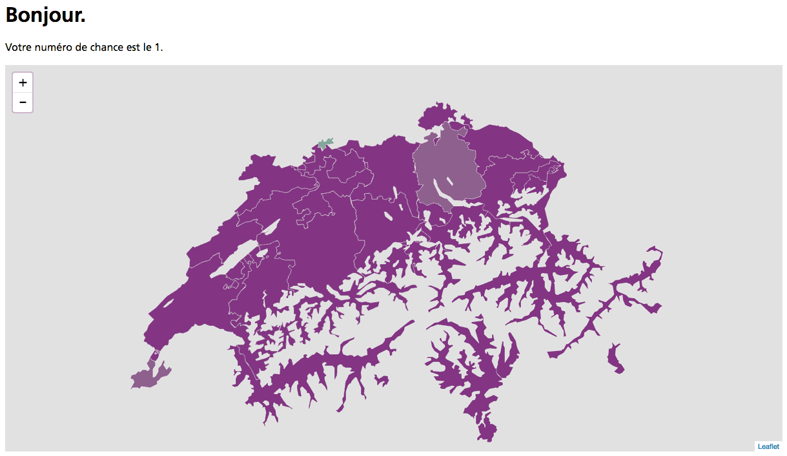
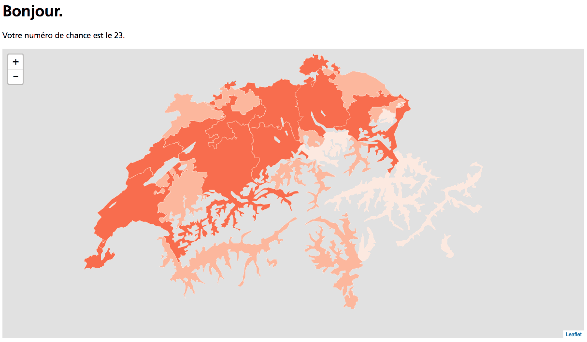
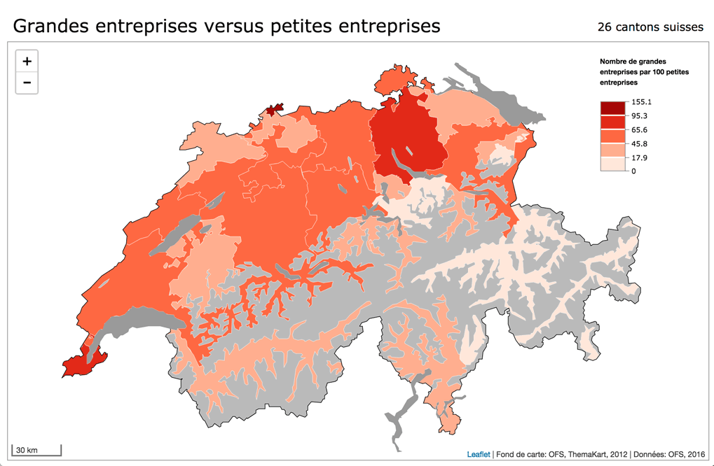

## Une application d'analyse spatiale...

Nous allons construire une petite application Web qui fait les choses suivantes:

- Afficher une carte thématique des cantons suisses, en prenant des données dans la base de données PostGIS.
- Effectuer une ACP et un clustering par k-means, et afficher le résultat sous forme d'un graphique simple.

L'applicaiton complète est disponible dans le répo Github [christiankaiser/carto-analyse-exemple](https://github.com/christiankaiser/carto-analyse-exemple). Pour chaque étape que nous allons voir il y a un **commit** ce qui permet de voir toutes les étapes de construction pas à pas.


### Étape 1. Préparer l'environnement de l'application

Avant de commencer le travail sur l'application elle-même, nous préparons l'environnement de travail pour notre application:

1. Nous créons un dossier pour l'application, p.ex. `carto-analyse-exemple`. Il peut être localisé n'importe où sur notre ordinateur.

2. Nous créons à l'intérieur de ce dossier un ___environnement virtuel Python___. C'est une façon de séparer l'application de notre installation Python sur notre ordinateur, et d'installer uniquement les modules qui sont nécessaires pour l'application. C'est une bonne pratique car ceci permet de facilement installer l'application sur un autre ordinateur (p.ex. par votre collègue qui travaille avec vous sur le projet), ou sur un serveur Web.

    Pour créer l'environnement virtuel:
    
    ```bash
    cd carto-analyse-exemple    # (si ce n'est pas déjà fait; adapter le nom du dossier...)
    virtualenv venv
    ```
    
    Ceci crée un dossier `venv` dans notre dossier de projet. Si `virtualenv` n'est pas disponible, il faut d'abord l'installer avec `pip install virtualenv`. Voir éventuellement des instructions plus détaillées comme [ici](http://docs.python-guide.org/en/latest/dev/virtualenvs/).
    
3. Nous devons à chaque fois que nous ouvrons un Terminal ___activer l'environnement virtuel___. Ceci se fait comme suit:

    ```bash
    source venv/bin/activate
    ```
    
    Nous pouvons alors observer un changement dans le _prompt_ du Terminal; le nom de l'environnement virtuel y figure entre parenthèses.
    
    Pour désactiver l'environnement virtuel, il suffit de passer la commande `deactivate`, ou on peut simplement fermer la fenêtre du Terminal (chose que nous ne devons pas faire maintenant...).

4. Nous voulons éviter que le dossier `venv` figure dans notre répo Git. En effet, il contient les modules Python spécifiques à notre ordinateur. Sur un autre ordinateur, nous allons devoir recréer l'environnement virtuel et ré-installer les modules (chose qui est très simple car nous allons inclure plus tard la liste des modules dans un fichier `requirements.txt`). Pour exclure un dossier d'un répo Git, nous créons un fichier __`.gitignore`__ dans notre dossier; ceci sera un fichier caché car son nom commence avec un point. Nous y insérons simplement le dossier `venv`:

        venv/
        
5. Nous pouvons encore créer le répo Git, et passer notre premier **commit**:

        git init
        git status     # (pour voir la liste des fichiers à inclure)
        git add .gitignore
        git commit -m "Mise en place de l'environnement de travail"

    et si vous avez fait le nécessaire pour connecter votre répo à un serveur distant:
    
        git push


P.S. Si vous êtes sur macOS, il se peut que vous allez aussi voir des fichier `.DS_Store` dans votre répo Git. Ce sont des fichiers qui sont créés automatiquement par le Finder. Nous ne voulons pas de ces fichiers dans nos répos Git. Une façon efficace pour les exclure de tous les répos et de créer un fichier `.gitignore_global` dans notre dossier _"Home"_ et d'y insérer:

        *.DS_Store

et ces fichiers restoront à partir de maintenant en dehors du contrôle de Git.

P.P.S. Vous pouvez créer ce fichier avec `vim`:

        vim ~/.gitigore_global


### Étape 2: Une première application Web super simple...

Nous pouvons maintenant installer Flask. Flask est un module Python ordinaire et peut être installé avec 

```bash
pip install flask
```

Dans sa version la plus simple, une application Flask peut être un seul fichier Python, dans lequel nous devons faire les choses suivantes:

1. Importer le module Flask
2. Créer une instance d'une application
3. Créer au moins une fonction pour gérer les URLs accessibles (typiquement l'URL de base `/`, et potentiellement d'autres, plus complexes).
4. Faire tourner l'application

Nous créons un fichier que nous appelons `app.py` (mais il pourrait s'appeler n'importe comment) avec le contenu suivant:

```python
import flask

app = flask.Flask(__name__)
app.debug = True

@app.route('/')
def index():
    return 'Bonjour!'

if __name__ == '__main__':
    app.run()
```

Et puis nous pouvons faire tourner l'application dans le Terminal avec:

```bash
python app.py
```

Nous pouvons maintenant nous rendre à l'URL [http://localhost:5000](http://localhost:5000) pour voir le résultat (identique à [http://127.0.0.1:5000](http://127.0.0.1:5000)).

Analysons ce que fait l'application (avec au total 8 lignes de code!):

- `import flask` importe le module Flask
- `app = flask.Flask(__name__)` crée une application Flask avec comme nom le contenu de la variable `__name__`. Cette variable est définie automatiquement par Python et contient le contexte du script (par défaut `main`, mais ceci peut être différent si on importait notre application comme un module quelque part ailleurs).
- `app.debug = True` active le mode de *débugage* et affichera des informations utiles supplémentaires en cas d'une erreur (et il y en aura!)
- `app.route('/')` lie l'URL de base `/` à la fonction `index` qui suit juste apprès (la fonction peut s'appeler n'importe comment). Cette fonction retourne, sous forme de chaîne de caractères, ce qui sera affiché dans le navigateur Web en consultant l'URL associée. Ceci peut être du code HTML, des données représentées en format JSON, ou comme ici simplement du texte.
- `app.run()` permet de lancer l'application. La condition un peu bizarre `if __name__ == '__main__':` fait que l'application tournera uniquement si le fichier est exécuté comme fichier principal et non importé comme module Python dans un autre programme.


### Étape 3. Fichiers statiques et templates

Avec Flask, il est facile:

- d'envoyer des fichiers statiques tel que scripts, fichiers CSS, images etc.
- et d'envoyer des fichiers HTML à partir d'un fichier, en utilisant un template.

Pour envoyer des fichiers statiques, il suffit de créer dans le même dossier que l'application Python un dossier ***static***. Si vous placez un fichier `script.js` dans ce dossier, il est automatiquement disponible à l'URL [http://localhost:5000/static/script.js](http://localhost:5000/static/script.js).

Nous allons donc créer le dossier `static` et un fichier `script.js` à l'intérieur, qui contiendra pour le moment juste une ligne:

```javascript
console.log('Hello, je suis script.js');
```

Cette méthode est très pratique pour des fichiers Javascript, images etc. Par contre pour nos fichiers HTML, nous  allons recourir aux ***templates**.. Un template contient l'ensemble du fichier à envoyer, mais on peut y placer également des variables qui seront définies depuis le script Python. Nous modifions notre fonction `index` de notre application pour qu'elle envoie un template HTML. Pour tester le tout, nous y plaçons également une variable avec le nom `random` (que nous allons enlever plus tard, c'est juste pour la démo...). La nouvelle fonction `index` est comme suit:

```python
# ajouter tout en haut:
from random import choice

# et puis à la place de l'ancienne fonction index:
@app.route('/')
def index():
    return flask.render_template(
        'index.html', 
        random=choice(range(1,46))
    )
```

où `index.html` est notre template, et `random` une variable Python à passer au template. Le fichier `index.html` doit se trouver dans un dossier ***templates***, à l'intérieur du dossier de l'application. Voici le contenu de ce fichier que nous allons mettre à jour dans les étapes ultérieures:

```html
<html>
<head>
    <meta charset="utf-8" />
    <title>Cartographie thématique et analyse spatiale</title>
    <script src="http://code.jquery.com/jquery-3.1.1.slim.min.js"></script>
    <script src="{{ url_for('static', filename='script.js') }}"></script>
</head>
<body>
    <h1>Bonjour.</h1>
    <p class="hide">Votre numéro de chance est le {{ random }}.</p>
</body>
</html>
```

Les éléments variables sont placées entre double accolades: `{{ ... }}`. Nous avons 2 éléments variables:

1. `url_for('static', filename='script.js')`. `url_for` est une fonction définie par Flask pour obtenir une URL. On pourrait aussi y écrire `static/script.js`, mais utiliser la fonction Flask est la méthode à préférer en raison de possibles modifications futures.

2. `random` qui est la variable passée depuis notre fonction du haut, et qui changera à chaque chargement de la page.

Le langage utilisé pour les templates est défini par [Jinja](http://jinja.pocoo.org). Il permet de définir non seulement des variables, mais aussi des boucles, conditions, ou encore des templates modulaires où un fichier de base définit par exemple le design général de notre site, et un template pour chaque contenu afin de ne pas écrire deux fois le même code (prinicpe *DRY: Don't Repeat Yourself*).


Consultez la nouvelle page. Est-ce que tout fonctionne correctement? Ouvrez également la console Javascript. Est-ce que vous y trouvez le message de notre `script.js`?


### Étape 4. Mettre en place la base de données

Il est maintenant temps de créer notre base de données PostGIS. Nous allons appeler la base de données `carto_analyse_dev`. Nous pouvons choisir le nom librement, mais souvent on donne le nom de l'application Web suivi du mode dans lequel l'application tourne (`dev` pour développement, `prod` pour production, `test` pour les tests).

```bash
createdb carto_analyse_dev
```

Nous pouvons nous connecter à la base de données avec:

```bash
psql carto_analyse_dev
```

(ou avec pgAdmin, Postico etc.). Nous pouvons maintenant activer PostGIS pour notre base de données:

```sql
CREATE EXTENSION postgis;
```

et puis quitter `psql` avec `^D ` (ctrl-D).

Nous allons importer la couche Shape des cantons suisses de ThemaKart (disponible sur Unilgis: `20_Europe/Switzerland/All/Administration/THK/Productive/Cantons/c_shp/K4kant19970101vf_ch2007Poly.shp`). Pour ce faire, nous utilisons l'utilitaire `shp2pgsql`:

```bash
cd /Volumes/Unilgis/20_Europe/Switzerland/All/Administration/THK/Productive/Cantons/c_shp/
shp2pgsql -s 21781 -I -W latin1 K4kant19970101vf_ch2007Poly.shp k4_cantons_vf > ~/Desktop/k4_cantons_vf.sql
```

Le fichier SQL est créé sur le bureau. Nous pouvons l'importer dans PostGIS:

```bash
psql carto_analyse_dev < ~/Desktop/k4_cantons_vf.sql
```

La BD `carto_analyse_dev` devrait maintenant avoir une table `k4_cantons_vf` avec une colonne `id1` qui contient les noms des cantons, et une colonne `geom` avec les géométries. La requête suivante nous donne la superficie en hectares, en ordre descendant:

```sql
SELECT id1 AS canton, ROUND(ST_AREA(geom) / 10000) AS superficie 
FROM k4_cantons_vf
ORDER BY superficie DESC;
```

Quel est le canton avec la plus grande superficie? Notez que la couche contient uniquement les surfaces potentiellement productives...


Par la même occasion, **nous importons le tableau de données `cantons_data`**, disponible dans `data/cantons_data.sql` du projet sur Github:

```bash
psql carto_analyse_dev < data/cantons_data.sql
```


### Étape 5. Connecter Flask à PostGIS

C'est le moment de connecter notre application Web à PostGIS pour y chercher les géométries des cantons. Pour cela, nous allons créer une nouvelle URL (`@app.route`) `/cantons` qui retourne les cantons en GeoJSON, ce qui est un format reconnu par Leaflet.

Tout d'abord, nous devons installer le module Python ___psycopg2__ qui permet de se connecter à PostgreSQL depuis Python:

```shell
pip install psycopg2
```

En même temps, __nous créons un fichier qui contient la liste complète des modules Python installés__. Ce fichier permettra à d'autres personnes de mettre en place exactement le même environnement de travail. Ce fichier est généralement appelé __`requirements.txt`__, et on peut le générer avec:

```shell
pip freeze > requirements.txt
```

Ainsi, si vous reprenez un projet d'un collègue, il vous suffit de lancer la commande `pip install -r requirements.txt` pour installer tous les modules nécessaires...

À chaque fois que nous ajoutons un module Python, nous devons répéter la commande `pip freeze > requirements.txt`.

Nous pouvons maintenant implémenter une première version de notre URL `/cantons` qui lit les données depuis PostGIS (mais qui ne renvoie pas encore du GeoJSON):

```python
# quelque part en haut du fichier:
import psycopg2 as db
import json

# créer une connexion à PostgreSQL: (adapter en fonction de votre base de données!)
conn = db.connect("dbname='carto_analyse_dev' user='moi' host='localhost' password=''")


# et puis en dessous la fonction de la route `/`:
@app.route('/cantons')
def cantons():
    # obtenir un curseur vers la base de données:
    cur = conn.cursor()
    # exécuter la requête SQL:
    cur.execute("""SELECT id0 AS fid, id1 AS canton,
                       ST_AsGeoJson(ST_Transform(geom, 4326), 7) AS geom
                   FROM k4_cantons_vf""")
    # et demander l'ensemble du résultat de la requête:
    cantons = cur.fetchall()
    # retourner le résultat en format JSON:
    return flask.jsonify(cantons)
```

Si nous inspectons maintenant le résultat en consultant l'URL [http://localhost:5000/cantons](http://localhost:5000/cantons), nous pouvons voir que la requête SQL fonctionne bien.

Notez que nous avions importé les cantons avec le CRS CH1903/LV03 (EPSG:21781), et nous faisons une projection à la volée avec PostGIS en WGS84, car c'est ce que nous allons utiliser avec Leaflet.

<div style="border: 1px solid #aaa; background-color: #f4f4f4; padding: 10px 15px; margin: 20px 0;">
Un problème peut survenir avec les caractères spéciaux (notamment les accents):

Votre application refuse de tourner avec un blabla du style <br>`SyntaxError: Non-ASCII character '\xc3' in file app.py`<br>Dans ce cas, il faut insérer la ligne suivante sur la première ligne de votre fichier Python:<br>
   
   __`# coding=utf8`__

</div>


Ce résultat se laisse déjà voir, mais ce n'est pas encore le bon format. Nous devons produire les données en format GeoJSON, qui est simplement le format JSON mais avec une structure bien définie (voir [geojson.org](http://geojson.org/) pour consulter la défintion formelle du format GeoJSON). Voici un exemple très simple de fichier GeoJSON:

```json
{
    "type": "FeatureCollection",
    "features": [
        {
            "type": "Feature",
            "geometry": { "type": "Point", "coordinates": [6.579500, 46.526446] }
            "properties": { "id": 1, "name": "Géopolis" }
        },{
            "type": "Feature",
            "geometry": { "type": "Point", "coordinates": [7.398596, 46.229966] }
            "properties": { "id": 1, "name": "IGD site de Sion" }
        }
    ]
}
```

Nous devons donc reproduire le même format avec ce que nous avons reçu de PostGIS. Nous avons les valeurs des `properties`, ainsi que la `geometry` sous forme de `string`.

Nous pouvons compléter notre fonction `cantons` comme suit pour reproduire cette structure de données:

```python
@app.route('/cantons')
def cantons():
    # obtenir un curseur vers la base de données:
    cur = conn.cursor()
    # exécuter la requête SQL:
    cur.execute("""SELECT id0 AS fid, id1 AS canton,
                       ST_AsGeoJson(ST_Transform(geom, 4326), 7) AS geom
                   FROM k4_cantons_vf""")
    # et demander l'ensemble du résultat de la requête:
    cantons = cur.fetchall()
    # créer la structure des données pour GeoJSON:
    features = []
    for row in cantons:
        features.append({ 
            "type": "Feature", 
            "properties": { "geocode": row[0], "nom": row[1] },
            "geometry": json.loads(row[2])
        })
    feature_collection = {
        "type": "FeatureCollection",
        "features": features
    }
    # retourner le résultat en format JSON:
    return flask.jsonify(feature_collection)
```

Notez la commande `json.loads(row[2])` qui permet de convertir une chaîne de caractères qui contient du JSON en objet Python.

Si nous consultons maintenant l'URL [http://localhost:5000/cantons](http://localhost:5000/cantons) nous devrions voir le résultat en format GeoJSON. Il est dès lors possible d'utiliser ce résultat avec Leaflet dans une carte interactive, ou d'enregistrer le tout dans un fichier `.geojson` et l'afficher dans QGIS.


### Étape 6. Créer la carte interactive

Nous pouvons maintenant créer notre carte interactive Leaflet pour afficher les cantons dans le navigateur de nos utilisateurs.

Pour cela, nous allons modifier le fichier `index.html` qui se trouve dans `templates`. Ci-dessous le nouveau fichier HTML; nous avons essentiellement ajouté la librairie Leaflet, ainsi qu'un `div` qui accueillera la carte. Nous avons également changé le nom du fichier Javascript de `script.js` en `index.js`, pour faire un lien plus explicite entre les deux fichiers (`index.js` va avec `index.html`). Nous avons également introduit un lien vers un fichier CSS qui est encore à créer.

```html
<html>
<head>
    <meta charset="utf-8" />
    <title>Cartographie thématique et analyse spatiale</title>
    <script src="http://code.jquery.com/jquery-3.1.1.min.js"></script>
    <link rel="stylesheet" href="https://unpkg.com/leaflet@1.0.3/dist/leaflet.css" />
    <script src="https://unpkg.com/leaflet@1.0.3/dist/leaflet.js"></script>
    <link rel="stylesheet" href="{{ url_for('static', filename='style.css') }}" />
</head>
<body>
    <h1>Bonjour.</h1>
    <p class="hide">Votre numéro de chance est le {{ random }}.</p>
    <div id="mapdiv"></div>
    <script src="{{ url_for('static', filename='index.js') }}"></script>
</body>
</html>
```

Notez que le script `index.js` est chargé tout à la fin du `body`. Ceci parce qu'il contient des références vers le contenu du `body` (la carte en l'occurrence). Si ce fichier est chargé avant, le navigateur exéctuera le code tout de suite, et ne trouvera pas le `div` _mapdiv_ car il n'existe pas encore à ce moment...

Nous avons également changé la version de jQuery. Nous utilisons maintenant la version complète (nous en aurons besoin juste après).

Le fichier `style.css` dans `static` qui contient les dimensions de notre carte:

```css
#mapdiv{ 
    height: 600px;
    width: 100%;
}
```

et le fichier `index.js` (renommer `script.js` en `index.js`):

```javascript
var map = L.map('mapdiv').setView([46.9, 8.2], 8);
```


Nous devrions voir maintenant la carte Leaflet dans le navigateur, mais encore sans contenu.

Pour rajouter les cantons à notre carte, nous pouvons utiliser la fonction `L.geoJSON` de Leaflet. Pour cela, nous devons avoir un objet GeoJSON à notre disposition. Nous devons demander cet objet explicitement depuis notre URL `/cantons` que nous avons créé auparavant. Ceci peut se faire avec la fonction [`$.getJSON`](https://api.jquery.com/jQuery.getJSON/) de jQuery, qui fonctionne comme suit:

```javascript
$.getJSON( url, function(data){
    // fonction qui s'exécute automatiquement une fois
    // que nous avons le résultat de la requête
    // `data` contient alors le résultat de la requête
    ...
});
```

Nous pouvons donc ajouter le code suivant à notre fichier `index.js`:

```javascript
$.getJSON('/cantons', function(data){
  L.geoJSON(data).addTo(map);
});
```

et recharger la page. Pas encore très beau, mais nous avons tout de même chargé du GeoJSON depuis PostGIS dans une application Leaflet...!


## Étape 7. Première version d'une carte thématique

Pour faire une carte thématique, il nous faut avoir les données qui nous permettent de faire la cartographie. Nous allons simplement inclure ces données dans le fichier GeoJSON. Ceci implique une modification de la fonction `cantons` dans `app.py`, ainsi qu'une jointure dans la requête SQL. Voici la nouvelle requête SQL que nous allons utiliser:

```sql
SELECT id0 AS fid, id1 AS canton,
  ST_AsGeoJson(ST_Transform(geom, 4326), 7) AS geom,
  D.abbr, accients_1000hab, rapport_gde_petites_entreprises,
  rapport_temporaire_100permanent, rapport_nonhab_100hab, 
  votation_immigration_masse_2014, votation_fonds_ferroviaire_2014,
  pop2012
FROM k4_cantons_vf C LEFT OUTER JOIN cantons_DATA D ON C.id0::integer = D.geocode;```

Notez le `LEFT OUTER JOIN` qui nous garantit d'avoir les géométries de tous les cantons, même en cas de données manquantes!

Intégré dans la fonction `cantons`, ceci donne:

```python
@app.route('/cantons')
def cantons():
    # obtenir un curseur vers la base de données:
    cur = conn.cursor()
    # exécuter la requête SQL:
    cur.execute("""SELECT id0 AS fid, id1 AS canton,
                       ST_AsGeoJson(ST_Transform(geom, 4326), 7) AS geom,
                       abbr, accients_1000hab, rapport_gde_petites_entreprises,
                       rapport_temporaire_100permanent, rapport_nonhab_100hab, 
                       votation_immigration_masse_2014, votation_fonds_ferroviaire_2014,
                       pop2012
                    FROM k4_cantons_vf C 
                    LEFT OUTER JOIN cantons_DATA D 
                    ON C.id0::integer = D.geocode""")
    # et demander l'ensemble du résultat de la requête:
    cantons = cur.fetchall()
    # créer la structure des données pour GeoJSON:
    features = []
    for row in cantons:
        features.append({ 
            "type": "Feature", 
            "properties": { 
                "geocode": row[0], "nom": row[1],
                "abbr": row[3], "accients_1000hab": float(row[4]),
                "rapport_gde_petites_entreprises": float(row[5]),
                "rapport_temporaire_100permanent": float(row[6]),
                "rapport_nonhab_100hab": float(row[7]),
                "votation_immigration_masse_2014": float(row[8]),
                "votation_fonds_ferroviaire_2014": float(row[9]),
                "pop2012": int(row[10])
            },
            "geometry": json.loads(row[2])
        })
    feature_collection = {
        "type": "FeatureCollection",
        "features": features
    }
    # retourner le résultat en format JSON:
    return flask.jsonify(feature_collection)
```

Consultez l'URL [http://localhost:5000/cantons](http://localhost:5000/cantons) pour vérifier que tout marche bien.

Nous pouvons maintenant __utiliser ces données__ dans le script JS __pour faire la cartographie__. Pour cela, nous précisons dans la fonction `L.geoJSON` le style à utiliser:

```Javascript
L.geoJSON(data, {style: styleFn).addTo(map);
```

où `styleFn` est une fonction que nous devons encore définir. Cette fonction reçoit comme argument le ___feature GeoJSON___ (c'est-à-dire un canton avec la géométrie et toutes les propriétés), et doit retourner un dictionnaire précisant le style à utiliser. Voici une première version qui fait un style unique:

```Javascript
var styleFn = function(feature){
  return {
    fillColor: '#669966',   // couleur de remplissage
    fillOpacity: 1,         // opacité du remplissage
    opacity: 1,             // opacité du contour
    weight: 0.4,            // largeur du contour
    color: '#ffffff',       // couleur de contour
  };
};
```

Nous pouvons maintenant adapter notre fonction `styleFn` pour retourner une couleur de remplissage différente en fonction de la valeur d'une propriété. Nous faisons ici une __carte thématique du rapport entre les grandes et petites entreprises__. Ainsi, nous pouvons faire dans un premier temps:

```Javascript
var styleFn = function(feature){
  var v = feature.properties.rapport_gde_petites_entreprises * 100;
  return {
    fillColor: 'rgb(120, '+ parseInt(v) +', 120)',
    fillOpacity: 1,
    opacity: 1,
    weight: 0.4,
    color: '#ffffff', 
  };
};
```

Après rechargement de la page, nous pouvons voir que la couleur de remplissage varie légèrement d'un canton à l'autre. C'est une première étape, mais ce n'est pas encore très efficace au niveau communication. Nous allons améliorer ce résultat dans l'étape suivante.




## Étape 8. Mise en classes et couleurs

Pour une cartographie efficace, nous devons faire une mise en classes et attribuer des couleurs aux différents cantons. Nous allons utiliser la librairie Javascript __[Classybrew](https://github.com/tannerjt/classybrew)__ pour cela. Classybrew fonctionne grosso modo avec les instructions suivantes (exemple générique que nous adapterons plus loin):

```javascript
var brew = new classyBrew();
brew.setSeries([86.4, 61.7, 47.0, 38.8, 15.7, 34.9, 33.8, 34.0, 43.2]);
brew.setNumClasses(3);
brew.setColorCode("Reds");
brew.classify('jenks');
var couleur = brew.getColorInRange(45.7);
console.log(couleur);
```

On doit donc créer un _objet Classybrew_, puis définir les données, le nombre de classes, la palette de couleurs et la méthode de classification avant de pouvoir obtenir la couleur à partir d'une valeur. Toutes ces étapes de préparation peuvent être accomplies suite à la chargement des données GeoJSON (et avant l'ajout des géometries à la carte!). Voici la nouvelle version de la fonction `$.getJSON('/cantons', ...)`:

```javascript
var brew;   // variable globale pour l'objet Classybrew

$.getJSON('/cantons', function(data){
  // Extraction des valeurs en vue de la mise en classes
  var valeurs = [];
  for (var i in data.features){
    var feat = data.features[i];
    valeurs.push(feat.properties.rapport_gde_petites_entreprises);
  }

  // Nous pouvons maintenant faire la mise en classes
  brew = new classyBrew();
  brew.setSeries(valeurs);
  brew.setNumClasses(5);
  brew.setColorCode("Reds");
  brew.classify('jenks');
  
  L.geoJSON(data, {style: styleFn}).addTo(map);
});
```

Ceci nous permet d'obtenir la bonne couleur à partir de la valeur de la variable, dans la fonction `styleFn`:

```javascript
var styleFn = function(feature){
  var v = feature.properties.rapport_gde_petites_entreprises;
  return {
    fillColor: brew.getColorInRange(v),
    fillOpacity: 1,
    opacity: 1, 
    weight: 0.4, 
    color: '#ffffff', 
  };
};
```

P.S. Le code des palettes de couleurs peut être trouvé [ici](http://tannerjt.github.io/classybrew-www/examples/basic/). Les palettes correspondent à celle de [ColorBrewer](http://colorbrewer2.org).

Le résultat devrait être un peu plus convaincant:




## Étape 9. La légende

Pour la légende, nous créons un _«contrôle Leaflet»_ qui s'affichera dans un des coins de la carte. Voici le code pour un contrôle simple, juste pour avoir une idée comment ça fonctionne:

```javascript
var legend = L.control({position: 'topright'});

legend.onAdd = function(map){
    var div = L.DomUtil.create('div', 'legend');
    div.innerHTML = '<p>Hello Suisse!</p>';
    return div;
};

legend.addTo(map);
```

Nous pouvons implémenter notre légende avec un peu de SVG (que nous allons apprendre plus tard), et adapter la fonction `onAdd` en conséquence:

```javascript
legend.onAdd = function(map){
      var div = L.DomUtil.create('div', 'legend');
      var svg = '<svg width="130" height="' + (colors.length*20+35) + '">';
      for (var i=0; i < n; i++){
        svg += '<rect x="1" y="'+ (10+i*20) +'" width="35" height="19" fill="'+colors[n-i-1]+'" stroke="#fff" stroke-width="1" />';
      }
      svg += '<rect x="1" y="10" width="35" height="'+(n*20-1)+'" fill="none" stroke="#000" stroke-width="0.4" />';
      for (var i=0; i<n; i++){
        svg += '<line x1="36" y1="'+(10+i*20)+'" x2="42" y2="'+(10+i*20)+'" stroke="#000" stroke-width="0.4" />';
        svg += '<text font-family="Verdana" font-size="10" x="45" y="'+ (14+i*20) +'">'+ Math.round(breaks[n-i]*1000)/10 +'</text>';
      }
      svg += '<line x1="36" y1="'+(9+n*20)+'" x2="42" y2="'+(9+n*20)+'" stroke="#000" stroke-width="0.4" />';
      svg += '<text font-family="Verdana" font-size="10" x="45" y="'+ (13+n*20) +'">'+ Math.round(breaks[n-i]*1000)/10 +'</text>';
      svg +=    '</svg>';
      div.innerHTML = '<p>Nombre de grandes entreprises par 100 petites entreprises</p>' + svg;
      return div;
  };
```

Toute la légende est construite sur la base du nombre de classes, c'est pour cela que ça parait un peu compliqué à prime abord.

Nous pouvons encore éditer un peu le fichier CSS pour améliorer le rendu de la légende, notamment donner une couleur de fond.


## Étape 10. Décoration...

À partir de là, nous pouvons encore améliorer un peu la «décoration» de la carte, comme:

- titre, sous-titre
- source des données
- ajouter une échelle
- ajouter d'autres couches de données, p.ex. le contour de la Suisse, les lacs, les pays voisins etc.
- limiter l'étendu de la carte à la Suisse
- ...

Par contre, il n'y a (presque) plus aucune difficulté au niveau technique à partir d'ici... Voici à quoi pourrait ressembler le résultat:





## La suite...

Il est maintenant relativement facile de modifier notre application afin de laisser l'utilisateur sélectionner la variable à visualiser.

Il est aussi possible d'implémenter des cartes en symboles proportionnels et symboles proportionnels colorés.

Pour aller plus loin, on peut également affiner l'interaction de la carte, ajouter des graphiques en lien avec la carte, ou afficher deux ou plusieurs cartes en parallèle. Par contre, si on veut faire une application Flask un peu plus conséquent, il est une bonne idée de passer un moment pour bien structurer le code, p.ex. en créant un ou plusieurs modules Python avec les fonctions les plus communes, ou la même chose du côté Javascript.


