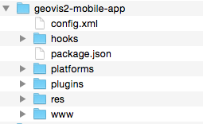

# Applications mobiles avec HTML et Javascript

Le but de cet exercice est de montrer comment créer facilement une application pour appareil mobile (iOS et Android) sur la base de code HTML et Javascript, et spécialement en intégrant Leaflet et la géolocalisation de l'appareil mobile.

## 1. Principe de base

Les applications mobiles pour iOS et Android nécessitent en principe un environnement de développement spécifique. Dans le cas d'iOS, il faut développer les applications avec Xcode (qui ne tourne que sur macOS) et avec le langage Swift respectivement le prédécesseur Objective-C. Dans le cas d'Android, il faut installer le kit de développement ad-hoc et développer les applications en Java.

Pour beaucoup d'applications, ces environnements spécifiques ne sont pas nécessaires, et l'investissement dans l'apprentissage de deux environnements est relativement lourd. Du coup, des solutions pour développer des applications en HTML et Javascript ont vu le jour.

Le principe est simple. Chaque environnement, iOS et Android, proposent des différentes composantes pour construire l'interface graphique (p.ex. des boutons, images, etc.). Et sur iOS comme sur Android, il y a une composante qui n'est rien d'autre qu'une «vue navigateur Web» (appelée parfois WebView). Cette WebView permet d'afficher du HTML et il est possible d'exécuter du code Javascript. Du coup, il est possible de faire tourner une application HTML/Javascript à l'intérieur d'une de ces WebViews.

Cette approche a quelques inconvéniants:

- Il faut toujours développer l'application de base en Swift resprectivement Java.
- Certaines fonctionnalités qui sont spécifiques à l'appareil mobile doivent être implémentées à part, en Swift ou en Java. Un exemple qui nous concerne spécialement est la géolocalisation. D'autres exemples sont p.ex. l'accès à la caméra de l'appareil mobile, ou encore à la bibliothèque de photos.

Pour palier à ces problèmes, des solutions génériques ont été développées, dont la plus connue et populaire est certainement [Apache Cordova](https://cordova.apache.org/). Il s'agit en plus d'une solution open-source et gratuite.

## 2. Installer Cordova

Avant de pouvoir installer Cordova, il faut installer:

1. Node.js depuis [nodejs.org](https://nodejs.org). On peut tester si c'est déjà installé en tapant `node -v` dans le Terminal, et il faut aussi tester si NPM est installé avec `npm -v`. En prinicpe, NPM vient avec Node.js. Assurez-vous que vous avez une version à peu près à jour.

2. L'environnement de développement mobile (SDK) de votre choix (Xcode pour iOS depuis l'AppStore, ou [Android Studio](https://developer.android.com/studio/index.html)).

Chaque SDK (Software Development Kit) vient avec un émulateur d'appareil mobile qui permet de faire tourner votre application mobile sur l'ordinateur. Tandis que l'émulateur iOS est très bien fait et très réactif, celui d'Android laisse souvent à désirer par sa lenteur.

Une fois que tout est installé, il suffit de taper la commande suivante dans le Terminal pour installer Cordova:

```bash
sudo npm install -g cordova
```

ou sur Windows:

```bash
npm install -g cordova
```

Une fois que c'est fait, on doit en principe pouvoir exécuter la commande

```bash
cordova
```

dans le Terminal (cette commande affiche juste un petit texte d'aide).

## 3. Créer une appliation Cordova

Cordova permet de créer une application multi-plateformes de la manière suivante:

```bash
cordova create <nom-du-dossier> <id-application> <nom-application>
```

donc p.ex. quelques chose comme:

```bash
cordova create geovis2-mobile-app ch.unil.geovis GeovisUNIL
```

`ch.unil.geovis-app` est un identifiant typique d'une application mobile, avec une sorte de nom de domaine inversé, mais qui n'a pas de lien direct avec le domaine.

Cette commande crée la structure de base d'une application HTML/JS mobile:



Le dossier `platforms` contient les applications spécifiques pour chacune des plateformes (iOS, Android, mais en principe aussi Blackberry et Windows Mobile). Pour l'instant ce dossier est vide car nous n'avons pas encore déclaré sur quelles plateformes notre application devra tourner.

Le dossier `www` contient l'application HTML et Javascript. C'est là où la plus grande partie du travail ira.

Par défaut, le dossier `www` contient une application HTML très simple. Cette application a quelques particularités:

- Le fichier `index.html` contient une référence vers un fichier JS `cordova.js` qui n'existe pas. Ce fichier JS sera en effet rajouté plus tard au moment où on construit l'application mobile native.

- Le fichier `index.html` contient également une série de balises `meta` qui sont spécifiques à une application mobile.

- Le fichier `js/index.js` contient un script de lancement qui détecte si l'application est prête à fonctionner. Dans le cas le plus simple, nous pouvons ignorer ce code. Si on veut par contre recevoir des événements spécifiques de l'appareil mobile, nous devons utiliser ce mécanisme selon la documentation de Cordova.

En dehors de ces quelques contraintes, nous sommes complètement libres à construire l'application HTML que nous voulons et de la mettre dans le dossier `www`.

## 4. Une application HTML avec jQuery Mobile

En principe, on n'a besoin de rien d'autre pour faire une application HTML mobile. Mais les applications mobiles ont une interface graphique avec des éléments typiques et faciles à reconnaître. C'est relativement fastidieux de construire tous ces éléments graphiques en HTML et Javascript sans librairie supplémentaire. Pour cette raison, plusieurs librairies Javscript ont vu le jour, dont une qui est [jQuery Mobile](http://jquerymobile.com/) (qui ne remplace pas jQuery, mais au contraire qui est construite sur jQuery). Ainsi, il devient relativement facile à construire une application mobile avec des éléments typiques, plusieurs pages, etc.

L'idée de base de jQuery Mobile est que toute l'application est contenue dans un seul fichier HTML (typiquement `index.html`), même si l'application possède en principe plusieurs pages.

Le répo Git [geovis-leaflet-jquery-mobile](https://github.com/christiankaiser/geovis-leaflet-jquery-mobile) contient une application simple avec deux pages, et une carte Leaflet sur la deuxième page. [Voici l'aperçu de l'application.](https://cdn.rawgit.com/christiankaiser/geovis-leaflet-jquery-mobile/3b352a50014fb9f8bee9255e974a69dc2cd9aad2/index.html) Cette application n'est pas adaptée à Cordova, il s'agit d'une application HTML standard qui utilise la géolocalisation et l'affiche sur la carte.

## 5. Application mobile pour une plateforme

Nous allons maintenant adapter l'application jQuery Mobile pour la transformer en application mobile native. La première chose à faire est d'activer une ou plusieurs plateformes dans notre application Cordova:

```bash
cd <dossier-de-notre-application-cordova>
cordova platform add ios
```

pour une application iOS. Utiliser `cordova platform add android` pour une application Android.

On peut lister les plateformes activées:

```bash
cordova platform ls
```

## 6. Adapter l'application jQuery Mobile pour Cordova

Nous pouvons maintenant insérer notre application jQuery Mobile dans le dossier `www`, et adapter légèrement notre application JS.

Les modifications à apporter sont presque anéctodiques:

- ajouter `cordova.js`
- modifier l'initialisation de l'application pour attendre l'événement `onDeviceReady` qui est lancé par Cordova une fois que l'application mobile est prête

[Visualiser les modifications sur Github...](https://github.com/christiankaiser/geovis-cordova-app/commit/a7ccc6b5897a45f562b6c8aa622ca0961b646773)


## 7. Compiler et faire tourner l'application

Finalement, nous pouvons compiler l'application avec:

```bash
cordova build
```

et la faire tourner avec

```bash
cordova run ios
```

(respectivement `cordova run android`). Ceci lance l'émulateur mobile et charge l'application dans l'émulateur.

Si vous branchez votre appareil mobile sur l'ordinateur, vous pouvez faire tourner l'application sur votre téléphone. Avec iOS, il faut créer un «provisioning profile», qui demande un compte développement iOS (payant évidemment...).

La commande `cordova build` a par ailleurs créé un projet Xcode ou Android Studio. Pour une application iOS, il est possible d'ouvrir le projet Xcode et de charger l'application dans l'AppStore d'Apple (à condition d'avoir un compte développement et des certificats d'authenticité de l'application, le premier payant, le deuxième juste un peu compliqué à créer). Accessoirement, il faudra encore créer quelques icônes et écrans de démarrage. Mais sur le principe, tout est là...

## 8. Zut, on a oublié d'activer la géolocalisation...

Tout d'abord on ne voit pas que la géolocalisation ne fonctionne pas dans l'application mobile. En effet, il faut installer un plugin Cordova qui l'active. Les applications mobiles activent uniquement ce qui est strictement nécessaire, pour économiser la batterie, et pour des raisons de protection de la vie privée.

Les plugins Cordova disponibles peuvent être visualisés sur la page [cordova.apache.org/plugins](https://cordova.apache.org/plugins/).

Pour installer un plugin:

```bash
cordova plugin add cordova-plugin-geolocation
```

Il est important de bien lire la page du plugin pour connaitre des éventuelles limites dans l'utilisation du plugin. Ainsi, le plugin de géolocalisation nécessite d'ajouter le contenu suivant dans le fichier `config.xml` pour tourner correctement sur iOS:

```xml
<edit-config file="*-Info.plist" mode="merge" target="NSLocationWhenInUseUsageDescription">
    <string>Need location access to show your position on the map.</string>
</edit-config>
```

Pour visualiser les plugins actuellement installés:

```bash
cordova plugin ls
```

Il est nécessaire de faire un `cordova build` par la suite.


## Alternatives à Cordova et jQuery Mobile

Cordova avec jQuery Mobile n'est évidemment pas la seule possibilité pour créer une application mobile avec HTML et Javascript.

Parmi les alternatives, j'aimerais mentionner deux possibilités qui sont très intéressantes:

1. **React Native**. ReactJS est une libraire Javascript développée par Facebook pour sites Web qui permet de construire des applications modernes de manière relativement simple. ReactJS est basée sur des composantes qui peuvent interagir entre elles. React Native est l'équivalent de ReactJS pour appareils mobiles. React est devenu très populaire, et React Native permet de créer des applications très performantes avec quasiment le même code que ReactJS. Une solution très intéressante pour ceux qui aimeraient aller plus loin dans le développement Web et mobile!

2. **Meteor**. Meteor est un environnement serveur-client, avec une base de données Meteor intégrée. Les applications sont développées en Javascript et peuvent être des applications Web normales, ou des applications mobiles. Solution également très intéressante, mais moins populaire que React.

