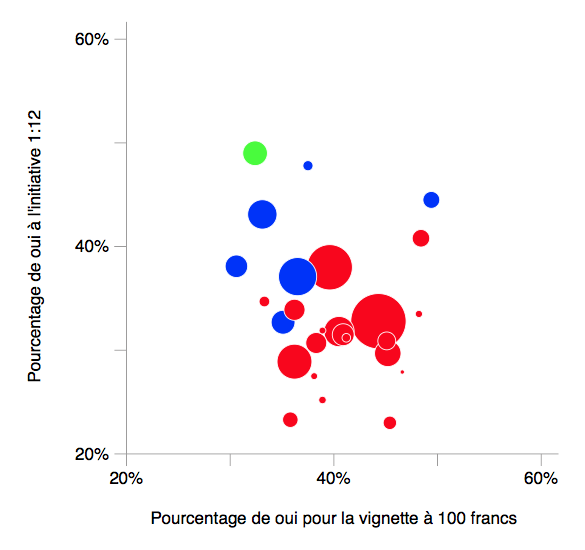

# Tutoriel SVG

L'objectif de cet exercice est de créer un graphique en utilisant le langage de dessin vectoriel SVG.

Dans un premier temps, le but est de créer (et de comprendre!) l'exemple du fichier `ex2/votations.html` et qui représente le graphique suivant:

Dans un deuxième temps, nous utilisons une libraire Javascript ([Raphaël](http://www.raphaeljs.com)) pour créer le graphique au lieu de le faire "à la main", et en ajoutant en même temps encore un peu d'interactivité. Le résultat du tutoriel se trouve dans le fichier `ex3/graphique-raphael.html` (les quelques fichiers Javascript qui se trouvent dans le même dossier font partie de l'exemple).

Le tutoriel est expliqué à travers les vidéos disponibles ici:  
[https://www.youtube.com/playlist?list=PLbjixabFMUzMbiW5nFae-5jdQTVOLem5b](https://www.youtube.com/playlist?list=PLbjixabFMUzMbiW5nFae-5jdQTVOLem5b)