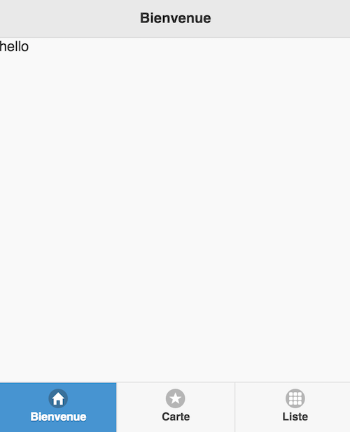
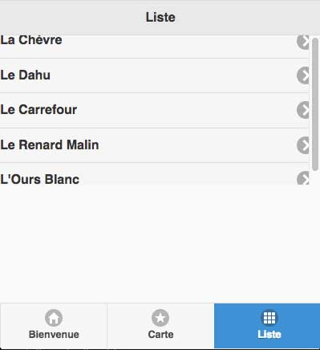
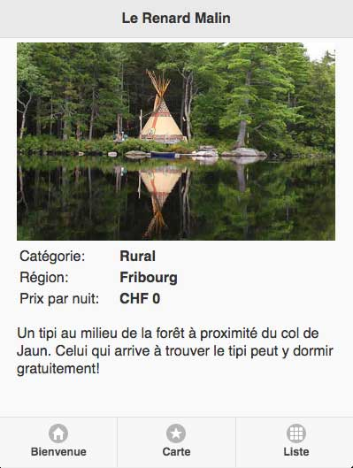
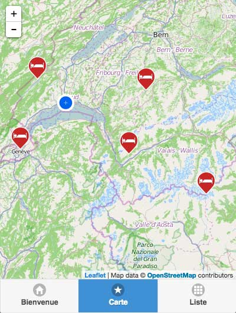

# Exercice: Application mobile

Cet exercice vise à créer une application mobile simple, en utilisant HTML et un peu de Javascript.

La création d'une application mobile avec HTML est simple, et c'est une pratique très courante. Des librairies tel que [jQuery Mobile](http://jquerymobile.com) mettent à disposition les éléments de l'interface utilisateur, il suffit de les intégrer dans notre code. Afin de transformer notre application Web en véritable application mobile, on peut utiliser [PhoneGap Build](https://build.phonegap.com).

Nous allons maintenant mettre en place l'application étape par étape. Il est conseillé de suivre toutes les étapes en parallèle, et de ne pas simplement copier-coller tout le code.

## 1. Squelette de l'application

Nous allons construire notre application mobile en utilisant la libraire [jQuery Mobile](http://jquerymobile.com). Une application jQuery Mobile comprend un fichier HTML ainsi que quelques fichiers CSS, Javascript et images pour la librairie.

**Même une application mobile complète avec plusieurs pages peut se trouver dans un seul fichier HTML.**

La clé du code HTML spécifique à jQuery Mobile sont des attributs `data-XXX` où XXX est une propriété jQuery Mobile. L'attribut le plus fréquent est `data-role`, qui fait généralement partie d'une balise `div` et qui définit le rôle du `div`. Ainsi, le code

    

         bla bla bla
    

définit une page d'une application (à cause de `data-role="page"`) avec identifiant *"welcome"*.

Ainsi, une application complète avec une seule page peut être écrite comme suit:

    <!DOCTYPE html>
    <html>
    <head>
        <meta charset="utf-8" />
        <title>Appli mobile</title>
        <link rel="stylesheet" href="lib/jquery.mobile-1.4.5.min.css" />
        
        
        <meta name="viewport" content="width=device-width, initial-scale=1.0, maximum-scale=1.0, user-scalable=no" />
    </head>
    <body>
        

            hello!
        

    </body>
    </html>

Les balises `script` et `link` chargent simplement les librairies jQuery et jQuery Mobile que nous avons déposé dans un dossier `lib`.

La balise `<meta name="viewport" ... />` définit des propriétés d'affichages spécifiques à une application mobile.

Cette première version de notre application est disponible sur [https://github.com/christiankaiser/geovis2/tree/master/cours-9/mobile-app/v1](https://github.com/christiankaiser/geovis2/tree/master/cours-9/mobile-app/v1).

Si on affiche l'application dans un navigateur Web, elle est encore extrêmement simple. Mais nous allons changer ça petit à petit...

## 2. Éléments de l'interface graphique

jQuery Mobile contient de nombreux éléments préfabriqués pour construire une interface graphique mobile moderne. Le site [demos.jquerymobile.com](http://demos.jquerymobile.com/1.4.5/) montre la plupart de ces éléments qui sont appelés **"widgets"**.

Dans un premier temps, nous ajoutons une entête et une barre de navigation à notre page encore un peu trop simple.

Pour ajouter une **entête**, il suffit d'ajouter un `div` à l'intérieur de la page, avec `data-role="header"`:

    

        <h1>Bienvenue</h1>
    

Le **contenu de la page** est du coup placé dans un `div` à part avec `data-role="content":

    

        hello
    

La barre de navigation fait également partie de la page, et peut être inséré dans le bas de page. Ceci demande un peu plus de travail: d'abord nous insérons un bas de page qui reste collé en bas dans toutes les situations:

    

    ...
    

et à l'intérieur du *"footer"*, nous pouvons insérer la barre de navigation:

    

    ...
    

 
qui à son tour doit accueillir la liste des pages disponibles dans l'application. Cette liste est simplement une *unordered list* `ul` dans laquelle on insère les différents *list items* `li`:

    <ul>
        <li><a data-icon="home" class="ui-btn-active ui-state-persist">Bienvenue</a></li>
        <li><a href="#map" data-icon="star">Carte</a></li>
        <li><a href="#liste" data-icon="grid">Liste</a></li>
    </ul>
 
Le premier élément `li` est le bouton actif. Pour indiquer cet état actif, on indique `class="ui-btn-active ui-state-persist"` à l'intérieur d'un lien `a` qui est en réalité inactif (absence d'attribut `href`). En option, on peut donner une icône au bouton avec `data-icon="home"`.

Le deuxième et troisième élément sont des **liens vers deux autres pages** de notre application que nous allons créer un peu plus tard. Le contenu de l'attribut `href` correspond à l'identifiant de nos pages que nous allons créer.

Notre page complète prend donc la forme suivante:

    

        

            <h1>Bienvenue</h1>
        

        

            hello
        

        

            

                <ul>
                    <li><a data-icon="home" class="ui-btn-active ui-state-persist">Bienvenue</a></li>
                    <li><a href="#map" data-icon="star">Carte</a></li>
                    <li><a href="#liste" data-icon="grid">Liste</a></li>
                </ul>
            

        

    

Cette version de l'application est disponible à l'URL [https://github.com/christiankaiser/geovis2/tree/master/cours-9/mobile-app/v2](https://github.com/christiankaiser/geovis2/tree/master/cours-9/mobile-app/v2).

## 3. Une application de plusieurs pages

Pour **créer des nouvelles pages,** nous pouvons simplement ajouter des `div` avec `data-role="page"` et un identifiant unique à la suite de notre document HTML. A l'intérieur de ces nouveaux `div`, nous devons répéter la même structure que celle que nous avons déjà vu. Nous devons notamment répéter la barre de navigation, ce qui peut paraître un peu inhabituel au début. En gros, nous allons avoir une structure un peu comme ça:

    

    ...
    

    
    

    ...
    

    
    

    ...
    

où chaque `div` correspond en grande partie au contenu couvert dans la section précédente.

Si les identifiants des pages (p.ex. `id="map"`) correspondent aux liens de la barre de navigation (`href="#map"`), jQuery Mobile change automatiquement d'une page à l'autre.

L'application avec les trois pages se trouve à l'URL [https://github.com/christiankaiser/geovis2/tree/master/cours-9/mobile-app/v3](https://github.com/christiankaiser/geovis2/tree/master/cours-9/mobile-app/v3).

Nous allons compléter la carte et la liste par la suite. Pour l'instant, nous avons juste mis un texte bidon.

## 4. Créer la liste

Sur la troisième page de notre application nous allons afficher une liste de nos hôtels de rêve. Une liste est simplement un `ul` qui a un rôle de **listview**. Etant donné que chaque élément de liste devra renvoyer vers la page de l'hôtel correspondant, nous devons aussi insérer un lien vers la page de l'hôtel que nous allons créer dans la section suivante. Le contenu de la page *"liste"* se présente donc comme suit:

    <ul data-role="listview">
        <li><a href="#hotel-1">La Chèvre</a></li>
        <li><a href="#hotel-2">Le Dahu</a></li>
        <li><a href="#hotel-3">Le Carrefour</a></li>
        <li><a href="#hotel-4">Le Renard Malin</a></li>
        <li><a href="#hotel-5">L'Ours Blanc</a></li>
    </ul>

Les liens vers *"#hotel-1"* à *"#hotel-5"* réfèrent aux pages encore à créer.

Si on affiche la page dans le navigateur, la liste apparaît effectivement, mais son style semble avoir eu un accident:

Pour corriger le style, nous créons un fichier **style.css** que nous devons inclure dans le `head` de notre fichier HTML `index.html`:

    <link rel="stylesheet" href="style.css" />

Il est important que cette ligne intervient après le chargement du style jQuery Mobile (autre ligne avec balise `link`).

Le problème vient d'une marge négative dans le style, ce qui peut être corrigé en mettant le code suivant dans le fichier `style.css`:

    .ui-content .ui-listview, .ui-panel-inner>.ui-listview {
        margin: 0;
    }

L'état de l'application après cette étape est disponible à l'URL [https://github.com/christiankaiser/geovis2/tree/master/cours-9/mobile-app/v4](https://github.com/christiankaiser/geovis2/tree/master/cours-9/mobile-app/v4)

Les liens vers les pages ne fonctionnent évidemment pas encore. Pour cela, nous devons créer les différentes pages des hôtels dans notre fichier HTML. C'est ce que nous faisons dans la section suivante.

## 5. Les pages des hôtels

Le plus simple est d'ajouter une page par hôtel à la main dans notre fichier HTML. En gros, il faut rajouter un contenu un peu comme ça à la suite des pages déjà présentes dans le fichier HTML:

    

    ...
    

    
    

    ...
    

    
    

    ...
    

    
    

    ...
    

    
    

    ...
    

Le contenu de ces pages est très similaire aux autres pages que nous avons déjà. C'est surtout le contenu qui doit être changé pour contenir les données de l'hôtel, avec peut-être une photo sympa. Voici un exemple ce que ça peut donner:

    

        

            <h1>La Chèvre</h1>
        

        

            
            <table>
                <tr><td>Catégorie:</td><td><b>Rural</b><td></tr>
                <tr><td>Région:</td><td><b>Vaud</b><td></tr>
                <tr><td>Prix par nuit: </td><td><b>CHF 150</b><td></tr>
            </table>
            
Dormez dans la paille à côté des chèvres!

        

        

            

                <ul>
                    <li><a href="#welcome" data-icon="home">Bienvenue</a></li>
                    <li><a href="#map" data-icon="star">Carte</a></li>
                    <li><a href="#liste" data-icon="grid">Liste</a></li>
                </ul>
            

        

    

Dans le contenu, il y a tout d'abord **une image de l'hôtel**. L'image se trouve dans le dossier `img`. Si nous voulons créer une application mobile qui n'a pas besoin de connexion Internet, nous devons intégrer dans l'application l'ensemble des images, scripts, styles etc. Ceci veut essentiellement dire qu'il faut éviter d'utiliser des liens qui commencent avec `http://...` ou `https://...`.

Les données factuelles, comme la catégorie ou le prix, se trouvent dans un tableau. Un tableau (balise `table`) est organisée en lignes (rows, balise `tr` = "table row"), et des cellules par ligne (balises `<td>...</td>`). En principe, il faut avoir dans chaque `<tr>...</tr>` le même nombre de cellules `<td>...</td>` (2 en l'occurence).

Le reste du code devrait être facile à comprendre.

Désormais, il est suffisant de répéter l'opération pour chacun des hôtels. Il ne faut pas oublier de copier les images utilisées dans le dossier `img`.

Par contre, si on affiche le résultat dans le navigateur, nous devons constater que le style d'affichage est encore loin d'être optimal. Un peu de CSS permet d'y remédier. 

Tout d'abord, si la fenêtre est trop petite, une partie du contenu reste cachée sous la barre de navigation. Nous pouvons le corriger en ajouter le code suivant dans `style.css`:

    .ui-content {
        padding: 0 0 70px 0 !important;
    }

Le padding défini une marge intérieure. Les 4 chiffres sont pour la marge du haut, à droite, en bas et à gauche, dans cet ordre. Le code `!important` dit que cette définition est plus importante qu'une éventuelle définition déjà existante. Donc le code ci-dessus introduit une marge intérieure du `div` du contenu de 70 pixels en bas.

De manière générale, le contenu est collé trop près au bord. Nous pouvons introduire une marge intérieure globale en modifiant le code ci-dessus en:

    .ui-content {
        padding: 5px 20px 70px 20px !important;
    }

Nous pouvons encore constater deux petits problèmes:

- L'image ne s'adapte pas à la largeur de la page
- Les cellules de gauche dans le tableau pourraient être un peu plus large pour avoir un espace entre *Prix par nuit:* et la valeur à droite

Ces deux problèmes peuvent être résolus avec le code CSS suivant:

    img {
        width: 100%;
    }

    td {
        padding-right: 20px;
    }

La présentation est désormais assez raisonnable.

Le code final de cette étape, avec le contenu des 5 hôtels de la liste, se trouve à l'URL  [https://github.com/christiankaiser/geovis2/tree/master/cours-9/mobile-app/v5](https://github.com/christiankaiser/geovis2/tree/master/cours-9/mobile-app/v5).

## 6. La carte

Il manque encore la carte de localisation de nos hôtels.

Avant de pouvoir faire une carte, nous devons inclure la libraire Leaflet dans notre application. Afin d'être indépendant d'Internet le plus possible, nous téléchargeons la librairie depuis [http://leafletjs.com/download.html](http://leafletjs.com/download.html) (télécharger la version 0.7.3), extraire l'archive, nommer le dossier `leaflet` et le mettre dans le dossier `lib`de notre application. Puis, il faut ajouter le CSS et Javascript dans le `head` de notre fichier HTML:

    <link rel="stylesheet" href="lib/leaflet/leaflet.css" />
    

Dans un deuxième temps, nous préparons la page qui va accueillir notre carte. Ceci consiste essentiellement en 2 choses:

1. ajouter un `div` avec identifiant qui accueillera la carte
2. enlever le titre de la page pour gagner un maximum de place pour la carte

Voici le code correspondant:

    

        

            

        

        

            

                <ul>
                    <li><a href="#welcome" data-icon="home">Bienvenue</a></li>
                    <li><a data-icon="star" class="ui-btn-active ui-state-persist">Carte</a></li>
                    <li><a href="#liste" data-icon="grid">Liste</a></li>
                </ul>
            

        

    

Il faut encore noter que l'identifiant du `div` de la carte n'est pas *"map"* comme d'habitude, car cet identifiant est déjà pris par la page. Nous le nommons donc par exemple *"mapdiv"*.

Pour créer la carte, nous devons comme d'habitude le faire avec Javascript. Nous créons donc un fichier `script.js` que nous incluons dans le `head` du fichier HTML:

    

La base du script est le même que celui pour une application normale:

    var map = null;

    function initMap(){
        map = L.map('mapdiv').setView([46.5, 6.8], 8);
        L.tileLayer('http://{s}.tile.osm.org/{z}/{x}/{y}.png', {
            maxZoom: 20,
            attribution: 'Map data © <a href="http://openstreetmap.org">OpenStreetMap</a> contributors',
        }).addTo(map);
    }

Mais il y a tout de même quelques différences spécifiques à une application mobile et à jQuery Mobile. La première différence est l'événement Javascript qui déclenche la création de la carte. Normalement, on crée la carte dès que l'ensemble du HTML est chargé. Dans une application mobile, où plusieurs pages sont réunies dans le même fichier HTML, nous créons la carte plus tard, au moment où l'utilisateur affiche la page de la carte. Ceci peut se faire simplement comme ça:

    $(document).on('pageshow', '#map', initMap);

Le problème avec cet événement est qu'il est déclenché à chaque fois que nous arrivons sur la page de la carte. Si nous changeons par exemple de la carte sur la liste et après à nouveau sur la carte, la carte serait créée deux fois, avec une erreur Javascript à la clé. Pour prévenir cette erreur, nous insérons la ligne suivante à la première ligne de la fonction `initMap`:

    if (map != null) return;

Cette ligne vérifie si la carte est déjà créée (`map != null`), et si c'est le cas, on arrête l'exécution de la fonction (`return`).

Si nous essayons maintenant d'afficher la carte dans notre application, la page reste vide. Le problème est que Leaflet nécessite des styles CSS spécifiques qui sont en conflit avec jQuery Mobile. Du coup, il faut les redéfinir pour notre carte, ainsi que les dimensions du `div` de la carte (à 100% de la place disponible):

    #map .ui-content {
        position: absolute;
        top: 0;
        right: 0;
        bottom: 56px;
        left: 0;
        padding: 0 !important;
    }

    #mapdiv {
        width: 100%;
        height: 100%;
    }

Ces styles permettent d'afficher la carte, mais un petit problème d'affichage peut subsister, comme illustré ci-dessous:

Ce problème est lié à nouveau à jQuery Mobile. La solution est un peu artistique. En effet, il faut demander à Leaflet de rafraîchir la carte et de recalculer les dimensions avec `map.invalidateSize()`. Le seul souci est qu'on ne peut pas le faire tout de suite, car jQuery n'est pas prêt à ce moment, mais quelques fractions de seconde plus tard. Il faut donc attendre un moment pour demander le rafraichissement à Leaflet. Attendre avec Javascript peut être fait avec la fonction `setTimeout` qui exécute une fonction après une période de temps donnée. Le tout se présente comme suit, à la fin de la fonction `initMap`:

    setTimeout(function(){
        map.invalidateSize();
    }, 100);

La fonction `function(){ map.invalidateSize(); }` est exécutée 100 millisecondes plus tard (0.1 seconde), et l'affichage est correcte par la suite. La différence de 0.1 seconde n'est pas réellement visible dans l'application.

Une caractéristique des applications mobiles est qu'on les utilise souvent en déplacement, et que les appareils mobiles peuvent facilement trouver la position géographique. Nous pouvons donc centrer la carte sur la position de l'utilisateur avec la fonction suivante:

    map.locate({setView: true, maxZoom: 10});

En plus, on peut insérer un marqueur à la position de l'utilisateur. Pour cela, il y a un événement Javascript qui est déclenché au moment où la position géographique est trouvée: `locationfound`. Nous pouvons donc exécuter une fonction à ce moment en écrivant:

    map.on('locationfound', onLocationFound);

Les deux lignes vont dans la fonction `initMap`.

Nous devons encore écrire la fonction `onLocationFound` qui insère un marqueur à la localisation de l'utilisateur. En plus, nous avons la précision de la localisation (*accuracy*) et pouvons dessiner un cercle dans lequel l'utilisateur se trouve probablement. Le tout se présente comme suit, en utilisant une icône personnalisée qu'il faut copier dans le dossier `img`:

    function onLocationFound(e) {
        var currentLocationIcon = L.icon({
            iconUrl: 'img/current-location.png',
            iconSize: [30, 30],
            iconAnchor: [15, 15],
            popupAnchor: [0, -35]
        });
        L.marker(e.latlng, {
            icon: currentLocationIcon
        }).addTo(map);
        var radius = e.accuracy / 2;
        L.circle(e.latlng, radius).addTo(map);
    }

Il faut encore noter que la localisation géographique fonctionne uniquement si l'application tourne sur un serveur Web. Faire tourner un serveur p.ex. avec

    cd dossier/de/l'application
    python -m SimpleHTTPServer

et aller à l'URL [http://127.0.0.1:8000](http://127.0.0.1:8000).

Le navigateur va demander l'autorisation d'utiliser la position de l'utilisateur, et le cas échéant, affiche la position à l'écran.

Il faut encore **afficher la position des hôtels**. Dans une application classique, nous pouvons demander un fichier GeoJSON et l'afficher par la suite. Dans une application mobile, cette façon de faire est possible mais demande une connexion Internet. Nous proposons ici une alternative. Le fichier GeoJSON est modifié en fichier Javascript: renommer en `hotels.js` et modifier le début du contenu en:

    hotels = {
        "type": "FeatureCollection",
        ...

Ceci définit une variable `hotels` que nous pouvons utiliser dans le Javascript. Par contre, il faut inclure le fichier `hotels.js` dans notre fichier HTML:

    

Pour créer les marqueurs des hôtels, nous faisons une nouvelle fonction `initaliserHotels` qui est appelée à la fin de la fonction `initMap`. La fonction reste essentiellement la même par rapport à une application traditionnelle (ne pas oublier de poser le fichier `plain-red-hotel.png` dans le dossier `img`:

    function insererHotels(){
        var hotelIcon = L.icon({
            iconUrl: 'img/plain-red-hotel.png',
            iconSize: [32, 41],
            iconAnchor: [16, 40],
            popupAnchor: [0, -40]
        });
        for (var i=0; i < hotels.features.length; i++){
            var coords = hotels.features[i].geometry.coordinates;
            var marker = L.marker([coords[1], coords[0]], {
                icon: hotelIcon
            }).addTo(map);
            hotels.features[i].marker = marker;
        }
    }

Le résultat est déjà bien:

La seule chose à faire est afficher des info-bulles avec un lien vers la page de l'hôtel correspondant. La page d'un hôtel est disponible avec le lien `href="#hotel-1"` où le numéro correspond à l'ID de lhôtel. Du coup, nous pouvons simplement insérer les deux lignes suivantes à la fin de la boucle à travers les hôtels dans le code ci-dessus:

        var p = hotels.features[i].properties;
        marker.bindPopup('<h1><a href="#hotel-'+p.id+'">'+p.name+'</a></h1>');

Ceci crée le lien dans la fenêtre pop-up qui est affichée automatiquement après un clic sur le marqueur.

Le code de l'application finale est disponible à l'URL [https://github.com/christiankaiser/geovis2/tree/master/cours-9/mobile-app/v6](https://github.com/christiankaiser/geovis2/tree/master/cours-9/mobile-app/v6).

Bien évidemment, il faut encore remplir un peu la page de bienvenue, mais c'est en principe du HTML standard.

## 7. Déployer comme application native

Il est relativement facile de transformer notre application Web en application native à l'aide de PhoneGap. A l'adresse [http://build.phonegap.com](http://build.phonegap.com), on peut créer un compte gratuit. Après, on peut uploaded une archive ZIP avec l'ensemble de notre code. Par la suite, PhoneGap crée automatiquement une application Android et Windows Phone qu'on peut télécharger et installer par la suite.

Pour des raisons de sécurité, une application iOS doit être signée par le développeur (une signature virtuelle) et vérifiée par Apple. Pour pouvoir faire cela, il faut avoir un compte développeur iOS (payant, environ 90$ par an), et puis il faut suivre les instructions d'Apple pour créer une signature virtuelle. Ces instructions sont à peu près aussi claires que de l'eau trouble et nous laissons ça pour les plus courageux...

