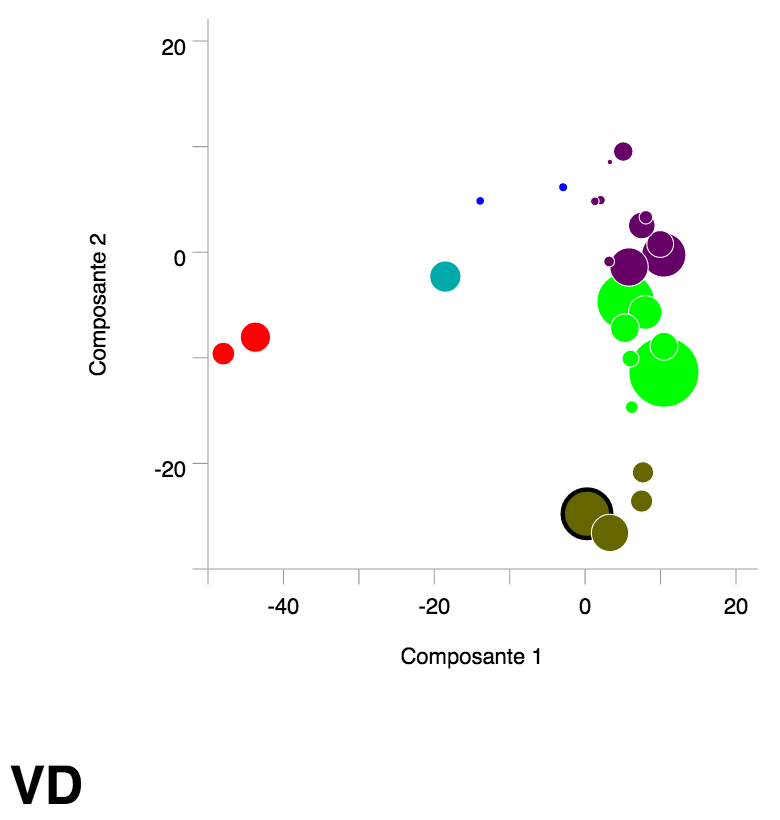

# Une application Web avec Flask

Cette exercice donne une introduction à la création d'une application Web avec Flask. Le but est de créer un graphique simple avec des données dynamiques:

Les instructions sont disponibles [ici](http://nbviewer.jupyter.org/github/christiankaiser/geovis2/blob/master/exercices/application-web-flask/README.ipynb).

