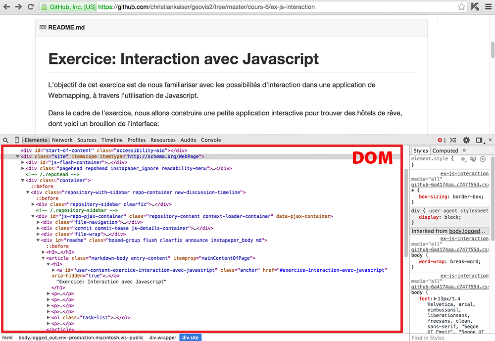
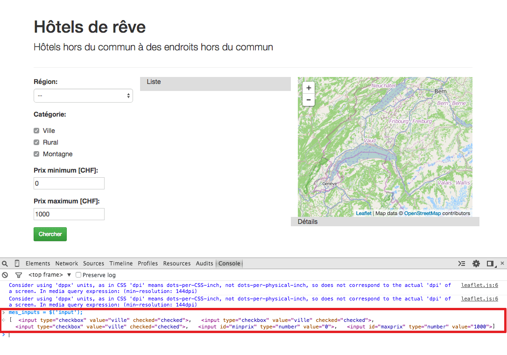

# Exercice: Interaction avec Javascript en utilisant jQuery et Leaflet

L'objectif de cet exercice est de nous familiariser avec les possibilités d'interaction dans une application de Webmapping, à travers l'utilisation de Javascript.

Dans le cadre de l'exercice, nous allons construire une petite application interactive pour trouver des hôtels de rêve, dont voici un brouillon de l'interface:

L'application contient un titre sur la largeur de la page. Dessous, nous trouvons une mise en page en **3 colonnes**:

1. la colonne de gauche contient les **options de recherche et filtres**. On peut notamment appliquer des filtres par région, catégorie, et prix.

2. la colonne du milieu contient la **liste des hôtels** correspondant à nos filtres.

3. la colonne de droite contient **en haut une carte** avec la localisation des hôtels, et **en bas les détails de l'hôtel sélectionné**.

---

## 1. Architecture de base

L'application est construite à l'aide des libraires [Bootstrap](http://getbootstrap.com/), [jQuery](http://jquery.com/) et [Leaflet](http://leafletjs.com/).

Le dossier [app-v1](https://github.com/christiankaiser/geovis2/tree/master/exercices/js-map-interaction-with-jquery/app-v1/) contient une première ébauche de l'application. Le fichier [index.html](https://github.com/christiankaiser/geovis2/tree/master/exercices/js-map-interaction-with-jquery/app-v1/index.html) contient la structure, tandis que l'ensemble du code Javascript a été placé dans le fichier [script.js](https://github.com/christiankaiser/geovis2/tree/master/exercices/js-map-interaction-with-jquery/app-v1/script.js).

Au niveau des filtres, pour des fins d'illustration, nous avons un menu déroulant, des cases à cocher, des boîtes de texte (ou plutôt des «boîtes de chiffres») ainsi qu'un bouton pour déclencher les filtres. Voici les détails de ces différents éléments:

### a. Menu déroulant

Le menu déroulant est appelé un `select` en HTML, et on donne l'ensemble des options possible dans le code HTML. Voici un exemple de menu en HTML:

    <select id="region">
        <option value="">Aucune région choisie</option>
        <option value="FR">Fribourg</option>
        <option value="GE" selected>Genève</option>
    </select>
 
Le menu déroulant commence avec `<select>` et se termine avec `</select>`. Entre deux, il y a toutes les options possibles entre des balises `<option>` et `</option>`. L'attribut `value` associe une valeur à chaque option, valeur qui est utilisée uniquement «en interne», à l'intérieur du code; elle n'est pas visible pour l'utilisateur de l'application. Le texte entre les deux balises est quant à lui visible pour l'utilisateur, mais ne joue pas vraiment un rôle à l'intérieur du code. L'attribut `id` dans la balise `<select>` donne un identifiant au menu qui doit être unique à travers l'ensemble du code HTML. L'attribut ´selected´ à l'intérieur de l'option «Genève» définit l'élément sélectionné au départ.

Voici le rendu du code ci-dessus:
<select id="region">
    <option value="">Aucune région choisie</option>
    <option value="FR">Fribourg</option>
    <option value="GE" selected>Genève</option>
</select>

### b. Boutons radio

Les boutons radio sont une alternative au menu déroulant si le nombre d'options est limité. Tout comme pour le menu déroulant, il y a une seule option sélectionné. Voici l'exemple de menu déroulant présenté ci-dessus sous forme de boutons radios:

<input type="radio" name="region" value=""> Aucune région choisie 
<input type="radio" name="region" value="FR"> Fribourg 
<input type="radio" name="region" value="GE" checked> Genève 

Les boutons radio prennent un peu plus de place, mais l'utilisateur voit sur un coup d'oeil l'ensemble des options. Si la place le permet et le nombre d'option ne dépasse pas 6-7 éléments, les boutons radio sont généralement à favoriser.

Voici le code de l'exemple ci-dessus:

    

        <input type="radio" name="region" value=""> Aucune région choisie 
        <input type="radio" name="region" value="FR"> Fribourg 
        <input type="radio" name="region" value="GE" checked> Genève 
    

Le fait que les trois ´input´ possèdent le même nom (´region´) définit que ce sont des boutons radio associés et qu'il ne puisse y avoir qu'une seule sélection.

### c. Cases à cocher (et labels)

Si plus d'une option peut être choisie à la fois, on utilise des cases à cocher («checkboxes») à la place des boutons radio:

<input type="checkbox" value="VD" checked> Vaud 
<input type="checkbox" value="FR"> Fribourg 
<input type="checkbox" value="GE" checked> Genève 

Et voici le code:

    

        <input type="checkbox" value="VD" checked> Vaud 
        <input type="checkbox" value="FR"> Fribourg 
        <input type="checkbox" value="GE" checked> Genève 
    

La seule différence notable par rapport aux boutons radio est le changement du type.

Le seul problème que nous avons avec ces exemples de boutons radio et cases à cocher, que bon nombre d'utilisateurs aimeraient bien cliquer sur le texte correspondant pour sélectionner une des options. Pour l'instant, dans notre code, cette association n'est pas faite, le texte de l'option et la case à cocher ou le bouton radio sont des éléments indépendants au niveau du code. Pour ce changer, nous devons avoir recours à des ***labels***. Il y a deux variantes possibles:

1. La première option est en utilisant un identifiant unique qui est définit dans l'attribut `id` de la balise `input` et qui est répété dans l'attribut ´for` de la balise ´label´:

        <input id="vd" type="checkbox" value="VD"> <label for="vd">Vaud</label>
   ce qui donne (essayez de cliquer sur le nom plutôt que la case à cocher):  
   <input id="vd" type="checkbox" value="VD"> <label for="vd">Vaud</label>
 
2. La deuxième option est d'insérer la balise `input` directement à l'intérieur de la balise `label`:

        <label><input type="checkbox" value="VD"> Vaud</label>
    ce qui donne à l'écran la même chose:  
    <label><input type="checkbox" value="VD"> Vaud</label>

### Boîtes de texte

Une boîte de texte est simplement un ´input´ de type texte:

    <input type="text" value="contenu">
    
ce qui donne:  
<input type="text" value="contenu">

ou avec un label:

    <label>Prix maximum: <input type="text" value="0"></label>

ce qui donne:  
<label>Prix maximum: <input type="text" value="0"></label>

Si le texte ne peut être qu'un chiffre, il est possible de changer le type en `number`:

<label>Prix maximum: <input type="number" value="0"></label>

ce qui donne:  
<label>Prix maximum: <input type="number" value="0"></label>

### Boutons

Un bouton peut être simplement inséré avec:

    <button>Cliquer ici</button>

ci qui donne:
<button>Cliquer ici</button>

Il est à noter que le bouton n'exécute aucune action par défaut. L'action devra être définie dans le code Javascript.

### Style des éléments

[Bootstrap](http://getbootstrap.com) définit toute une série de ***classes CSS*** pour donner une représentation familière aux différents éléments. Les filtres définies dans [app-v1](https://github.com/christiankaiser/geovis2/tree/master/exercices/js-map-interaction-with-jquery/app-v1/) en font un usage extensif, d'où la présence de plusieurs éléments HTML (notamment des `div`, mais pas seulement) qui ne semblent à première vue pas nécessaires.

---

## 2. Le DOM: Document Object Model

Un fichier HTML contient l'ensemble de la structure hiérarchique d'une page Web, y compris contenu et formatage. Le navigateur Web charge le fichier HTML dans sa mémoire et produit la représentation graphique de la page Web. Par la suite, l'utilisateur peut avoir la **possibilité d'interagir avec la page Web**, p.ex. à travers des menus déroulants, boutons, etc. Nous avons vu que l'option sélectionné d'un menu déroulant, ou le texte contenu dans une boîte de texte figure déjà dans le code HTML. Cependant, le navigateur Web ne va naturellement pas modifier le fichier HTML de départ. Le navigateur Web modifie uniquement la représentation interne du code HTML pour refléter les changements sur la page. Cette représentation interne du code HTML à l'intérieur du navigateur Web est appelé le **Document Object Model**, ou tout cour le **DOM**. Le DOM actuel d'une page Web peut être visualisé en mode développement du navigateur Web:

Pour simplifier, on peut dire qu'**une interaction avec une page Web passe généralement par une modification à la volée du DOM.** Afin de rendre interactif notre page Web, nous devons donc étudier les possibilités de modifier le DOM à l'aide de code Javascript. La libraire [jQuery](http://jquery.com) permet, entre autres, de modifier le DOM de manière relativement facile.

---

## 3. jQuery et le DOM

La première tâche de jQuery est généralement de `sélectionner` à l'aide de code Javascript un élément particulier sur la page Web, afin d'effectuer une manipulation sur l'élément sélectionné. La sélection d'un élément se fait à l'aide de la fonction jQuery `$` (c'est le nom de la fonction, tout comme p.ex. `main`, `alert`, etc.), suivi de ce qu'on appelle un **identificateur** d'élément. jQuery nous retournera l'ensemble des éléments qui correspondent à l'identificateur donné. Nous pouvons sélectionner par exemple l'ensemble des balises `input` à l'aide du code suivant (le résultat est attribué à la variable `mes_inputs`):

    mes_inputs = $('input');

La chaîne de caractère `'input'` est alors l'identificateur.  Il est possible d'exécuter ce code dans la console Javascript d'un navigateur Web pour tester l'expression:

Voici un aperçu de quelques identificateurs fréquents:

- `$('input')` sélectionne toutes les balises `input`
- `$('#region')` sélectionne tous les éléments dont l'attribut `id` contient la valeur `region` (notez que le dièse ne fait pas partie de l'ID, mais de l'identificateur jQuery)
- `$('.form-group)` sélectionne tous les éléments dont l'attribut `class` contient la valeur `form-group`. L'attribut `class` contient la **classe CSS** d'un élément. Il est à noter qu'un élément peut avoir plusieurs classes CSS en même temps; elles sont alors séparées par des espaces (un nom de classe ne peut pas contenir d'espace).
- `$('[name=region]')` sélectionne l'ensemble des éléments dont l'attribut `name` est égal à `region`.

Une fois un ou plusieurs éléments sélectionnés, il est possible d'effectuer des manipulations diverses, interroger les valeurs des attributs, modifier le contenu etc. Ci-dessous quelques exemples.

**Changement du style**: il est possible de modifier le style en utilisant la fonction `css`, p.ex.:

    ds = $('.form-group');
    ds.css('background-color', '#f00');

attribue la valeur `#f00` à la propriété CSS `background-color`. Vous pouvez essayer l'exemple sur l'exemple [app-v1](https://github.com/christiankaiser/geovis2/tree/master/exercices/js-map-interaction-with-jquery/app-v1/), dans la console Javascript. Le résultat n'est pas très beau... Pour revenir en arrière, il suffit de passer une valeur vide:

    ds.css('background-color', '');

 Il est possible d'ajouter ou d'enlever une class CSS:
 
    $('button').removeClass('btn-success');
    $('button').addClass('btn-primary');

Ou encore, en une seule instruction:

    $('.col-sm-3').addClass('col-sm-2').removeClass('col-sm-3')

ce qui permet de redimensionner des colonnes à la volée...

Cette méthode permet de modifier très facilement l'apparence d'un ou plusieurs éléments.

Nous pouvons également modifier le contenu d'un élément:

    colonneDuMilieu = $('.col-sm-4');
    colonneDuMilieu.html('<h1>Hôtels</h1>
Liste de tous les hôtels...
');

Nous pouvons donc modifier l'ensemble du contenu de la page Web avec quelques manipulations relativement simples...

---

## 4. Événements

Les événements sont un élément clé pour l'interactivité sur une page Web. En effet, ce sont les déclencheurs de nos actions, elles permettent de lancer un code Javascript. Le nombre d'événements possibles est grand, et nous allons regarder ici juste quelques-uns. Parmi les événements les plus fréquents, on trouve (avec les noms des événements entre parenthèses):

- un clic de souris (`click`)
- l'entrée de la souris dans un élément HTML (`mousenter`)
- la sortie de la souris dans un élément HTML (`mouseout`)
- le changement de statut d'un menu déroulant, d'une case à cocher, d'un bouton radio, etc. (`change`)
- le changement du contenu d'un champ texte (`change`)
- le clic sur un bouton (`click`)
- le scroll (`scroll`)
- le mouvement de la souris (`mousemove`)

et aussi, d'un style un peu différent:

- la fin de la chargement de la page HTML par le navigateur (`load`)
- la fin de la construction du DOM par le navgiateur (`ready`)
- le changement de la taille de la fenêtre (`resize`)

Une action (fonction Javascript) peut être «attachée» à un de ces événements, à l'aide de la fonction jQuery `on` avec comme arguments le nom de l'événement et la fonction à exécuter. Regardons ce code comme exemple:

    function ouf(){
    	alert('ouf!');
    }
    $('.page-header').on('click', ouf);

Ce code «attache» la fonction `ouf` à l'événement `click` du `div` contenant le titre de la page. Si on exécute ce code dans la console du projet [app-v1](https://github.com/christiankaiser/geovis2/tree/master/exercices/js-map-interaction-with-jquery/app-v1/), et on clique par la suite sur le titre, la fonction `ouf` est exécutée à chaque fois.

En plus, il est possible de retarder l'exécution d'une action, à l'aide de la fonction `setTimeout` qui prend la fonction à exécuter ainsi que le nombre de millisecondes à attendre:

    function ouf(){
        alert('ouf!');
    }
    function waitForOuf(){
        setTimeout(ouf, 2000);
    }
    $('.page-header').on('click', waitForOuf);

Ces deux mécanismes sont responsables pour l'interactivité dans beaucoup de situations. Il y a par exemple un événement `ready` qui est déclenché par la page Web (le `document`) une fois que le DOM est construit et qu'il est possible d'interagir correctement avec le DOM à l'aide de fonctions Javascript. Le code Javascript du projet [app-v1](https://github.com/christiankaiser/geovis2/tree/master/exercices/js-map-interaction-with-jquery/app-v1/) dans [script.js](https://github.com/christiankaiser/geovis2/tree/master/exercices/js-map-interaction-with-jquery/app-v1/script.js) utilise exactement ce mécanisme pour construire la carte sur la page. La carte est construite dans la fonction `buildMap`, qui est appelée depuis la fonction `main`. Cette fonction `main` quant à elle est exécutée automatiquement au moment ou la page Web est prête, ce qui est définie par l'instruction:

    $(document).on('ready', main);

La documentation jQuery contient la [liste de tous les événements](https://api.jquery.com/category/events/), avec une description.

### 4.1 Exemple: lancer le filtre des hôtels

Pour montrer un court exemple d'un événement, nous illustrons ici comment le filtre des hôtels dans le projet [app-v1](https://github.com/christiankaiser/geovis2/tree/master/exercices/js-map-interaction-with-jquery/app-v1/) peut être implémentée. A l'intérieur du [script.js](https://github.com/christiankaiser/geovis2/tree/master/exercices/js-map-interaction-with-jquery/app-v1/script.js), dans la fonction `main`, nous pouvons attacher une fonction à l'événement ´click´ du bouton «Chercher»:

    $('button').on('click', filtrerHotels);

Ceci nécessite évidemment de disposer d'une fonction `filtrerHotels`, ce qui n'est pas encore notre cas. Il suffit de la rajouter dans le fichier [script.js](https://github.com/christiankaiser/geovis2/tree/master/exercices/js-map-interaction-with-jquery/app-v1/script.js):

    function filtrerHotels(){
    	// suite du code ici..
    }

En insérant une instruction `console.log('filtrerHotels')` on peut vérifier si la fonction est bel et bien exécutée après un clic sur le bouton. Toujours utile de savoir si on a tout fait juste jusqu'à maintenant... `console.log` écrit le contenu donné dans la console Javascript, qui est invisible pour l'utilisateur moyen. On peut aussi y écrire des variables pour vérifier si elle contient une valeur attendue ou non. Très utile pour trouver les nombreuses erreurs.

Par la suite, dans la fonction `filtrerHotels`, il faut récupérer les valeurs des différents champs (région, catégorie, prix minimum et maximum). Là aussi, jQuery est d'une grande utilité, surtout la fonction `val` qui permet de récupérer la valeur actuelle:

    function filtrerHotels(){
        var region = $('#region').val();
        var minprix = parseInt($('#minprix').val());
        var maxprix = parseInt($('#maxprix').val());
        var cat_ville = $('#cat_ville')[0].checked;
        var cat_rural = $('#cat_rural')[0].checked;
        var cat_montagne = $('#cat_montagne')[0].checked;
    
        // contrôler le contenu des variables p.ex. comme ça:
        console.log( [region, minprix, maxprix, cat_ville, cat_rural, cat_montagne] );
        
        // suite du filtre...
    }

La fonction `parseInt` permet de transformer une chaîne de caractères en nombre entier. La vérification si les cases à cocher sont cochées ou non est un peu différentes, mais nous renseigne simplement si une case à cocher précise est cochée (`true`) ou non (`false`). Par la suite, on peut afficher les hôtels correspondants à ces critères, et cacher les autres. Au moins, si on avait une liste d'hôtels... Cacher un élément n'est pas le problème:

    $('.col-sm-4').addClass('hide');
    
... fait efficacement disparaître une des colonnes, et ...

    $('.col-sm-4').removeClass('hide');

... permet de la récupérer à nouveau. `hide` est par ailleurs une classe CSS qui est définie par Bootstrap.

## 5. Récupérer des données JSON avec Javascript

Nous allons récupérer les données sur les hôtels depuis un fichier externe qui est en format JSON. Ce fichier peut provenir ou non d'une base de données. Le format JSON permet d'enregistrer des données d'une manière qui est relativement facile à comprendre par l'humain et l'ordinateur, ce qui s'avère très pratique. Un fichier JSON est composé de dictionnaires, arrays, nombre entiers et décimales, et des chaînes de caractères, très similaire à ce que pourrait être un bout de code Javascript. Voici un exemple simple:

    {
        "nom": "Einstein",
        "prénom": "Albert",
        "naissance": 1879,
        "deces": 1955,
        "publications": [
            {"title": "E=mc2", "year": 1905},
            {"title": "Newton's apple", "year": 1906},
            {"title": "Schroedinger's cat", "year": 1907}
        ]
    }

Les espaces et retours à la ligne ne sont pas nécessaires, mais facilitent évidemment la lecture du fichier.

Il est possible de représenter par exemple un fichier ESRI Shape sous forme de JSON; le nom du format est alors GeoJSON. Voici un exemple d'un tel fichier:

	{
		"type": "FeatureCollection",                                  
		"features": [
			{
				"type": "Feature",
				"properties": { "id": 1, "name": "Bern" }, 
				"geometry": { "type": "Point", "coordinates": [ 7.45, 46.96 ] }
			}, { 
				"type": "Feature", 
				"properties": { "id": 2, "name": "Basel" }, 
				"geometry": { "type": "Point", "coordinates": [ 7.60, 47.56 ] }
			}, { 
				"type": "Feature", 
				"properties": { "id": 3, "name": "Lausanne" }, 
				"geometry": { "type": "Point", "coordinates": [ 6.60, 46.53 ] }
			}
		]
	}

Un fichier GeoJSON peut être généré avec QGIS depuis un fichier Shape, ce qui est intéressant pour le lire par la suite dans notre application Web.

Bien évidemment, il est possible de définir notre propre fichier JSON qui contient les informations nécessaires pour notre projet.

La lecture d'un fichier JSON dans une application Web peut se faire facilement avec jQuery:

    $.getJSON( url, callback_function );

où `callback_function` est une fonction que nous avons défini auparavant et qui reçoit le contenu du fichier JSON. C'est à l'intérieur de cette fonction que nous pourrons faire utilisation de ces données. Un aspect important qui porte souvent à confusion est l'ordre d'exécution. Considérons par exemple le code suivant:

    function insererDonneesJson(data) {
        alert('1 - insérer les données du fichier JSON');
    }
    
    $.getJSON('hotels.json', insererDonneesJson);
    alert('2 - appel du fichier JSON terminé');

La fonction `$.getJSON` demande un fichier JSON depuis le Web, et puis il est censé appeler avec le contenu la fonction `insererDonneesJson`. Cette fonction affiche simplement une boîte d'alerte. Et après la demande du fichier JSON, une autre boîte d'alerte est affichée à l'écran. Il peut être surprenant d'apprendre que généralement l'alerte '1 - insérer les données...' s'affiche après l'alerte '2 - appel du fichier ...'. Il est probablement encore plus surprenant d'apprendre qu'en fait, l'ordre d'exécution n'est simplement pas défini! Le problème vient du fait que **demander un fichier depuis le Web prend du temps**, beaucoup de temps à l'échelle de la vitesse d'exécution d'un programme informatique. Du coup, au lieu d'attendre une éternité informatique pour que le fichier arrive, l'ordinateur continue simplement à exécuter la suite du script. Ce qui est tout à fait ok vu que nous avons fourni une fonction qui sera exécuté automatiquement une fois que le fichier est arrivé, c'est-à-dire après une éternité...

Avec ces connaissances, nous pouvons maintenant demander les données sur les hôtels à insérer, et les insérer dans la liste. Nous pouvons par exemple insérer la ligne

    $.getJSON('hotels.json', insererDonneesJson);

à la fin de la fonction `main`, et insérer la fonction `insererDonnesJson` un peu plus bas:

    function insererDonneesJson(data){
        console.log(data);
    }

Si on recharge maintenant notre application, on sera déçu car ça ne fonctionne généralement pas. Dans Google Chrome, nous aurons une erreur mystérieuse dans la console:

<i>XMLHttpRequest cannot load file:///Users/.../hotels.json. Cross origin requests are only supported for protocol schemes: http, data, chrome, chrome-extension, https, chrome-extension-resource.</i>

Le problème est que la fonction `$.getJSON` fonctionne uniquement à travers un serveur Web, et nous n'avons pour l'heure pas de serveur... Le plus simple est: faire tourner un serveur Web. Pour cela, il y a de nombreuses options. Une des solutions les plus simples est d'exécuter le serveur Web intégré dans Python:

1. ouvrir le Terminal
2. `cd dossier/avec/fichiers/html/et/json`
3. taper `python -m SimpleHTTPServer` (ou si nous utilisons Python 3: `python3 -m http.server`)
4. se rendre à l'URL [http://127.0.0.1:8000](http://127.0.0.1:8000) ce qui est l'adresse de notre serveur Web que nous venons de démarrer à l'étape précédente

Il est bien évidemment aussi possible de faire tourner un serveur Web plus costaux, tel que [WAMP](http://www.wampserver.com) sur Windows. Sur Mac OS X, le serveur Web [Apache](https://httpd.apache.org) (utilisé par plus de 50% des sites Web) est déjà installé, il suffit de l'activer avec `sudo apachectl start` (il faut donner le mot de passe admin) et puis placer les fichiers dans `/Library/WebServer/Documents` avant de les accéder depuis le navigateur sous `http://localhost`.

Nous pouvons maintenant insérer les différents hôtels dans la liste. Pour cela, nous devons faire une boucle à travers l'ensemble des hôtels, et construire le code HTML que nous pouvons insérer dans le `div` prévu pour la liste. La fonction `insererDonneesJson` du [script.js](https://github.com/christiankaiser/geovis2/tree/master/exercices/js-map-interaction-with-jquery/app-v2/script.js) du projet [app-v2](https://github.com/christiankaiser/geovis2/tree/master/exercices/js-map-interaction-with-jquery/app-v2/) contient le code qui permet de le faire.

## 6. Afficher les détails de l'hôtel

Nous avons actuellement la liste des hôtels qui s'affiche dans la liste. Cependant, nous aimerions encore afficher les détails pour chaque hôtel à droite sous la carte. Dans notre cas, nous allons afficher notamment la description de l'hôtel en plus.

Avant d'écrire le code pour afficher ces détails, nous changeons un peu le style de la liste pour avoir un effet visuel sur le passage de la souris. Pour cela, nous modifions d'abord légèrement le code de la fonction `insererDonneesJson` pour définir une class CSS pour les différents `div` contenant les informations sur les hôtels. La nouvelle fonction se présente comme suit:

     1  function insererDonneesJson(data){
     2      hotels = data;  // garder les hotels en mémoire
     3      var html = '';
     4      for (var i=0; i < hotels.features.length; i++){
     5          var h = hotels.features[i];
     6          html += '
';
     7          html +=     '<h3>'+h.properties.name+'</h3>';
     8          html +=     '
Catégorie: '+h.properties.categorie+'
';
     9          html +=     '
Prix: '+h.properties.prix+' CHF
';
    10          html += '
';
    11      }
    12      // insérer dans la liste
    13      $('#hotels-liste').html(html);
    14  }

Le changement concerne la ligne 6 du script. Nous avons ajouté la class CSS `hoteldiv` pour chaque containeur d'un hôtel. A noter aussi que l'ancienne ligne 11 `html += '
';` a été supprimée.

Nous pouvons également créer un fichier `style.css` pour y mettre nos classes CSS. Nous devons inclure ce fichier dans le `head` de notre fichier `index.html`:

    <link rel="stylesheet" href="style.css" />

Voici un exemple de classe CSS pour la liste des hôtels:

    .hoteldiv {
      padding: 2px 10px 5px 15px;
      border: 1px solid #eee;
    }
    
    .hoteldiv:hover {
      background-color: #f0f0f0;
    }

Nous pouvons désormais **ajouter l'événement Javascript `mouseover`** qui déclenche l'affichage des détails de l'hôtel actuel. Il suffit de rajouter la ligne suivante à la fin de la fonction `insererDonneesJson`:

    $('.hoteldiv').on('mouseover', showHotelsDetails);

... et il faut encore écrire la fonction `showHotelsDetails`... Nous commençons par écrire une fonction vide:

    function showHotelsDetails(evt){
        // la suite ici
    }

Cette fonction prend un argument `evt` (évidemment vous l'appelez comme vous voulez) qui représente l'événement Javascript. Nous avons besoin de cet événement pour trouver l'identifiant du `div` qui à son tour nous permet de savoir de quel hôtel il s'agit. Pour cela il faut comprendre que les informations détaillées sur les hôtels se trouvent toujours dans la variable `hotels` qui a été créée sur la première ligne de la fonction `insererDonneesJson` et qui contient la `FeatureCollection` (c'est-à-dire grosso modo le fichier Shape). Nous devons chercher les informations détaillées dans cette variable, et pour cela nous devons connaître l'identifiant interne de l'hôtel qui se trouve dans l'`id` du `div` de l'hôtel. Alors comment extraire cet `id` de l'événement Javascript? Voici les étapes:

a. la variable `evt.target` contient l'élément HTML qui se trouve sous la souris. Ça peut être le `div` lui-même, ou n'importe quel élément HTML à l'intérieur du `div`, donc par exemple le `h3` avec le nom de l'hôtel.
b. nous regardons si notre `evt.target` contient la classe CSS `hoteldiv`. C'est une façon simple de savoir si l'élément HTML que nous avons est le `div` de l'hôtel, ou un des éléments à l'intérieur. Nous pouvons faire ceci avec `$(evt.target).hasClass('hoteldiv')`.
c. si notre «target» n'est pas le `div` de l'hôtel, nous devons le trouver. Ceci peut se faire grâce à la fonction jQuery de recherche de parents (les parents sont tous les éléments HTML à l'extérieur de l'élément actuel; un élément HTML à l'intérieur serait dans cette terminologie un enfant). Plus spécifiquement, nous cherchons un parent qui a comme class CSS `hoteldiv`, ce qui se présente comme suit: $(evt.target).parents('.hoteldiv').

Nous pouvons extraire l'`id` du `div` de l'hôtel avec le code suivant:

    function showHotelsDetails(evt){
        var divId = $(evt.target).attr('id');
        if ($(evt.target).hasClass('hoteldiv') == false){
            divId = $(evt.target).parents('.hoteldiv').attr('id');
        }
        // contrôle du fonctionnement:
        console.log(divId);
    }

Il est une bonne pratique de tester en permanence l'avancement de notre projet en écrivant des valeurs dans notre console Javascript. Si nous exécutons notre application et passons avec la souris sur la liste des hôtels, la console Javascript doit contenir les identifiants des `div`. 

L'identifiant de l'hôtel est uniquement la dernière partie de l'identifiant du `div`, c'est-à-dire le chiffre à la fin. Nous pouvons extraire cette valeur en remplaçant "hotel-div-" par rien:

    var hotelId = divId.replace("hotel-div-", "");

Il y a ici comme souvent d'autres manières de faire la même chose. Une des alternatives est d'extraire une partie de la chaîne de caractère, c'est-à-dire la partie qui commence à partir du caractère 11 (=index 10):

    var hotelId = divId.substr(10);

Il est maintenant temps de chercher l'hôtel avec cet identifiant dans la variable `hotels`. Pour cela, nous utilisons une méthode un peu rudimentaire: regarder un hôtel après l'autre pour voir si l'identifiant correspond. Et si c'est le cas, on mémorise cet identifiant. Ça peut paraître très inefficace de chercher dans l'ensemble de la liste des hôtels, surtout si nous avions 10'000 hôtels. Cependant, il s'avère qu'un téléphone mobile est en mesure d'exécuter environ 1.4 milliard d'instructions par seconde (à peu près 1500 fois plus rapide qu'un [Commodore 64 de 1982](http://fr.wikipedia.org/wiki/Commodore_64)), ce qui est amplément suffisant pour chercher dans la liste entière de quelques hôtels... Un ordinateur est à peu près 2 fois plus vite que le téléphone. Voici le code qui passe à travers l'ensemble des hôtels pour trouver l'hôtel avec l'identifiant cherché:

    var hotel = null;
    for (var i=0; i < hotels.features.length; i++){
        if (hotels.features[i].properties.id == hotelId){
            hotel = hotels.features[i];
        }
    }

Nous pouvons maintenant afficher les détails de l'hôtel. Pour cela, nous donnons un identifiant `id="details"` au `div` qui contiendra ces détails. Par la suite, voici un exemple de code qui permet d'afficher l'ensemble des informations disponibles sur un hôtel:

    var h = '
';
    h += '<h3>'+hotel.name+'</h3>';
    h += '
Catégorie: '+hotel.categorie+'
';
    h += '
Région: '+hotel.region+'
';
    h += '
Description: '+hotel.description+'
';
    h += '
Prix: '+hotel.prix+' CHF';
    h += '
';
    $('#details').html(h);

L'application complète jusqu'à cette étape se trouve dans le dossier [app-v3](https://github.com/christiankaiser/geovis2/tree/master/exercices/js-map-interaction-with-jquery/app-v3/).

---

## 7. Hôtels sur la carte

Un problème évident pour le moment est que les hôtels ne sont pas présentes sur la carte. Ce n'est pas trop compliqué de rajouter un marqueur. Nous ajoutons le marqueur au moment où nous avons reçu les données du fichier JSON, dans la fonction `insererDonneesJson`:

    for (var i=0; i < hotels.features.length; i++){
        var coords = hotels.features[i].geometry.coordinates;
        var marker = L.marker([coords[1], coords[0]]).addTo(map);
    }    

Nous allons également garder en mémoire le marqueur pour chaque hôtel, pour pouvoir l'utiliser plus tard. Il suffit d'ajour une ligne dans la boucle ci-dessus pour sauvegarder le marqueur à l'intérieur de la variable `hotels`:

    hotels.features[i].marker = marker;

Maintenant, on aimerait mettre en évidence le marqueur de l'hôtel de la liste sur lequel se trouve le curseur. Pour ce faire, nous allons remplacer simplement l'icône du marqueur. Ceci peut se faire à l'intérieur de la fonction `showHotelsDetails`. Tout d'abord, nous créons une nouvelle icône de marqueur, p.ex.

    var redHotelIcon = L.icon({
        iconUrl: 'https://github.com/christiankaiser/map-marker-icons/raw/master/icons/plain-red-hotel.png',
        iconSize: [32, 41],
        iconAnchor:   [16, 40],
        popupAnchor:  [0, -40]
    });

... et puis pour remplacer l'icône d'un hôtel:

    hotel.marker.setIcon(redHotelIcon);

Evidemment, il faut aussi remettre l'icône normale pour les autres marqueurs, sinon, ils gardent l'icône de remplacement pour toujours. Pour remettre l'icône par défaut, on peut écrire:

    hotel.marker.setIcon(new L.Icon.Default());

Si on met ensemble les pièces du puzzle, la boucle à travers l'ensemble des hôtels dans la fonction `showHotelsDetails` peut être écrite comme suit:

    ...
    
    // marker pour l'hôtel sélectionné
    var redHotelIcon = L.icon({
        iconUrl: 'https://github.com/christiankaiser/map-marker-icons/raw/master/icons/plain-red-hotel.png',
        iconSize: [32, 41],
        iconAnchor:   [16, 40],
        popupAnchor:  [0, -40]
    });
    
    // chercher l'hôtel dans la liste
    var hotel = null;
    for (var i=0; i < hotels.features.length; i++){
        if (hotels.features[i].properties.id == hotelId){
            hotel = hotels.features[i].properties;
            hotels.features[i].marker.setIcon(redHotelIcon);
        } else {
            hotels.features[i].marker.setIcon(new L.Icon.Default());
        }
    }
    
    ...

Naturellement, nous aimerions aussi que les détails de l'hôtel soit affichés également si on passe avec la souris sur un des marqueurs. Pour cela, il faut attacher un événement au marqueur, au moment où on insère le marqueur sur la carte:

    marker.on('mouseover', showHotelsDetailsMarker);

La fonction `showHotelsDetailsMarker` est similaire à la fonction `showHotelsDetails`, mais pas identique. La façon de trouver de quel hôtel il s'agit est très différente. En fait, le «target» de l'événement est le marqueur et non un `div` ou un autre élément HTML. Du coup, la recherche de l'hôtel dans la liste se fait un peu différemment:

    function showHotelsDetailsMarker(evt){
        // trouver l'id de l'hôtel
        var m = evt.target;
        var hotelId = null;
        for (var i=0; i < hotels.features.length; i++){
            if (m == hotels.features[i].marker){
                hotelId = hotels.features[i].properties.id;
            }
        }
        
        // la suite ici ...
    }

A partir de cet endroit, les deux fonctions sont strictement identiques. Une des règles d'or dans la programmation dit qu'il ne faut pas écrire deux fois le même code, car sinon il faut corriger une erreur potentielle deux fois ou plus. Nous pouvons facilement restructurer un peu notre code pour sortir la partie commune de la fonction `showHotelsDetails` dans une fonction à part, et appeler cette nouvelle fonction depuis les deux fonctions `showHotelsDetails` et `showHotelsDetailsMarker`, ce qui peut donner quelque chose comme:

    function highlightHotel(hotelId){
        // marker pour l'hôtel sélectionné
        var redHotelIcon = L.icon({
            iconUrl: 'https://github.com/christiankaiser/map-marker-icons/raw/master/icons/plain-red-hotel.png',
            iconSize: [32, 41],
            iconAnchor:   [16, 40],
            popupAnchor:  [0, -40]
        });
    
        // chercher l'hôtel dans la liste
        var hotel = null;
        for (var i=0; i < hotels.features.length; i++){
            if (hotels.features[i].properties.id == hotelId){
                hotel = hotels.features[i].properties;
                hotels.features[i].marker.setIcon(redHotelIcon);
            } else {
                hotels.features[i].marker.setIcon(new L.Icon.Default());
            }
        }
    
        // afficher les détails
        var h = '
';
        h += '<h3>'+hotel.name+'</h3>';
        h += '
Catégorie: '+hotel.categorie+'
';
        h += '
Région: '+hotel.region+'
';
        h += '
Description: '+hotel.description+'
';
        h += '
Prix: '+hotel.prix+' CHF';
        h += '
';
        $('#details').html(h);
    }
    
    function showHotelsDetailsMarker(evt){
        // trouver l'id de l'hôtel
        var m = evt.target;
        var hotelId = null;
        for (var i=0; i < hotels.features.length; i++){
            if (m == hotels.features[i].marker){
                hotelId = hotels.features[i].properties.id;
            }
        }
        highlightHotel(hotelId);
    }
    
    function showHotelsDetails(evt){
        // extraire l'id de l'hôtel
        var divId = $(evt.target).attr('id');
        if ($(evt.target).hasClass('hoteldiv') == false){
            divId = $(evt.target).parents('.hoteldiv').attr('id');
        }
        var hotelId = divId.replace("hotel-div-", "");
        highlightHotel(hotelId);
    }

---

## 8. Zoom sur un hôtel

Il peut être utile de proposer un bouton qui permet de faire un zoom sur l'hôtel sélectionné. Ce bouton pourrait être placé en bas des informations détaillées. Le placement du bouton peut se faire dans la fonction `highlightHotel`, au moment où on génère le code HTML avec les détails, p.ex.:

    h += '
<button id="hotelZoom" class="btn btn-default btn-xs">Montrer sur la carte</button>
';

Par la suite, il faut encore placer un événement Javascript pour lancer une fonction qui permettrait d'effectuer le zoom sur l'hôtel. Ceci peut se faire à la fin de la même fonction:

    $('#hotelZoom').on('click', hotelZoom);

où `hotelZoom` est la fonction à créer. Cette ligne de code doit intervenir après la ligne 

    $('#details').html(h);

car c'est seulement à ce moment où le bouton est inséré dans le DOM et qu'il est possible d'y lier un événement Javascript.

Maintenant, on peut écrire la fonction `hotelZoom`. La première chose à faire est extraire l'id de l'hôtel. Ceci peut se faire en utilisant l'`id` du `div` entourant le bouton:

    var hotelId = $(evt.target).parents('div').attr('id').replace('hotel-details-', '');

Par la suite, il faut trouver les coordonnées géographiques de l'hôtel dans la variable `hotels`. Il faut encore une fois passer à travers toute la liste des hôtels:

    var coords = null;
    for (var i=0; i < hotels.features.length; i++){
        if (hotels.features[i].properties.id == hotelId){
            coords = hotels.features[i].geometry.coordinates;
        }
    }

Maintenant, on peut centrer la carte sur l'hôtel:

    map.panTo([coords[1], coords[0]]);

Il peut être désirable de faire un zoom si la carte montre une étendu trop grande. On peut par exemple décider de faire qu'il faut avoir au minimum un niveau de zoom de 10. Nous pouvons donc par exemple demander le niveau de zoom actuel, et s'il est inférieur à 10, nous le mettons sur 10. Ceci peut se faire comme ça:

    var z = map.getZoom();
    if (z < 10) {
        z = 10;
    }
    map.setZoom(z);

Les 4 premières lignes de ce code peuvent être écrites comme ça:

    var z = map.getZoom() < 10 ? 10 : map.getZoom();

Il s'agit d'une condition `if (...) { ... } else { ... }` sur une ligne, avec le résultat qui est attribué à la variable `z`. La structure est: `condition ? valeur si vrai : valeur si faux;`. Donc, on pourrait lire la ligne ci-dessus comme *«si `map.getZoom() est plus petit que 10` donne la valeur de `10` et sinon la valeur de `map.getZoom()`». Choisissez la façon d'écrire que vous préférez.

Il est aussi possible de combiner une instruction `map.setZoom` et `map.panTo`:

    map.setView( [coord[1], coord[0]], z );

qui est l'instruction que nous retenons finalement dans la fonction `hotelZoom`:

    function hotelZoom(evt){
        var hotelId = $(evt.target).parents('div').attr('id').replace('hotel-details-', '');
    
        // chercher les coordonnées de l'hôtel
        var coords = null;
        for (var i=0; i < hotels.features.length; i++){
            if (hotels.features[i].properties.id == hotelId){
                coords = hotels.features[i].geometry.coordinates;
            }
        }
    
        // Centrer la carte sur l'hôtel, et augmenter le zoom si le niveau et inférieur à 10
        var z = map.getZoom() < 10 ? 10 : map.getZoom();
        map.setView([coords[1], coords[0]], z);
    
    }

Le code complet de l'application jusqu'à ce point est disponible dans [app-v4](https://github.com/christiankaiser/geovis2/tree/master/exercices/js-map-interaction-with-jquery/app-v4/).

---

## 9. Filtrer les hôtels

Nous filtrons maintenant la liste des hôtels en fonction des critères sélectionnés dans les options à gauche. Le filtrage est déclenché avec un clic sur le bouton *«Chercher»* à travers l'appel de la fonction `filtrerHotels`.

Le principe du filtrage est le suivant: au début nous affichons l'ensemble des hôtels. Puis nous traitons une option de filtrage après l'autre, et nous cachons simplement les hôtels dans la liste qui ne correspondent pas au critère. Ceci peut se faire simplement en ajoutant la classe CSS `hide` sur le `div` de l'hôtel, donc p.ex.:

    $('#hotel-div-4').addClass('hide');

Nous ne devons donc pas enlever l'hôtel de la liste, mais seulement le cacher. En plus, si nous ajoutons deux fois la même classe, ce n'est pas grave, l'instruction est simplement ignorée. Du coup, pour ré-afficher l'hôtel, il suffit de faire:

    $('#hotel-div-4').removeClass('hide');

Nous rendons également le marqueur correspondant transparent, ce qui peut se faire avec:

    hotels.features[0].marker.setOpacity(0);

et pour le ré-afficher:

    hotels.features[0].marker.setOpacity(1);

Concrètement, nous faisons une boucle à travers l'ensemble des hôtels dans la fonction `filtrerHotels`:

    function filtrerHotels(){
        var region = $('#region').val();
        ...
        
        for (var i=0; i < hotels.features.length; i++){
            var h = hotels.features[i];
            
            // afficher d'abord l'entrée dans la liste et le marker
            $('#hotel-div-' + h.properties.id).removeClass('hide');
            h.marker.setOpacity(1);
            
            // suite ici ...
            
        }
    }

Pour le filtre de la région, il suffit de vérifier si une région est sélectionnée, et le cas échéant si l'hôtel se trouve dans la région sélectionnée:

    if (region != '' && h.properties.region != region) {
        $('#hotel-div-' + h.properties.id).addClass('hide');
        h.marker.setOpacity(0);
    }

La condition vérifie que la variable `region` n'est pas vide et le cas échéant que la région sélectionnée n'est pas identique à celle de l'hôtel. Si c'est le cas, nous cachons l'hôtel car il est en dehors de la région sélectionnée.

Pour le prix minimum et maximum, le filtre se fait de manière similaire, c'est même un peu plus simple. Du coup, nous pouvons mettre les deux filtres dans la même condition:

    if (h.properties.prix < minprix || h.properties.prix > maxprix) {
        $('#hotel-div-' + h.properties.id).addClass('hide');
        h.marker.setOpacity(0);
    }

Et finalement pour les trois catégories ville, rural et montagne (seulement le code pour la catégorie ville est montrée, les deux autres étant idendiques):

    if (cat_ville == false && h.properties.categorie == 'Ville') {
        $('#hotel-div-' + h.properties.id).addClass('hide');
        h.marker.setOpacity(0);
    }

Bien évidemment, les données des filtres doivent correspondre aux données des hôtels du fichier JSON. Sinon, le filtre arrête de fonctionner correctement. Si on teste le code ci-dessus, on peut constater que le filtre de la région ne fonctionne pas parce que les valeurs du menu déroulant contiennent "VS", "VD" etc., tandis que le fichier JSON contient les noms complets. Nous ajustons donc le menu déroulant pour qu'il correspond aux valeurs du fichier JSON. Nous profitons aussi de cette occasion d'ajuster le contenu du menu.

Le code final de la fonction `filtrerHotels` ainsi que le nouveau menu déroulant se trouvent dans [app-v5](https://github.com/christiankaiser/geovis2/tree/master/exercices/js-map-interaction-with-jquery/app-v5/).

Ce code final contient également une petite dernière modification: **un scroll pour la liste des hôtels**, pour éviter que la page devienne trop longue. Nous limitons la hauteur de la liste des hôtels à 520 pixels (valeur arbitraire), et s'il n'y a pas assez de place, un scrollbar ou similaire est affichée. Le code correspondant dans le fichier `index.html` est:

    

        

            
Liste

        

    

où nous avons deux `div` imbriqués. Dans le `div` extérieur, nous appliquons deux styles CSS, le premier concerne la hauteur maximale (`max-height: 520px;`) et le deuxième l'affichage automatique du scrollbar (`overflow: auto;`).

La première version de notre application choc sur les hôtels est désormais terminée. Nous pouvons donc procéder aux tests utilisateurs pour trouver les problèmes d'utilisation (bien entendu, il y en a...).

